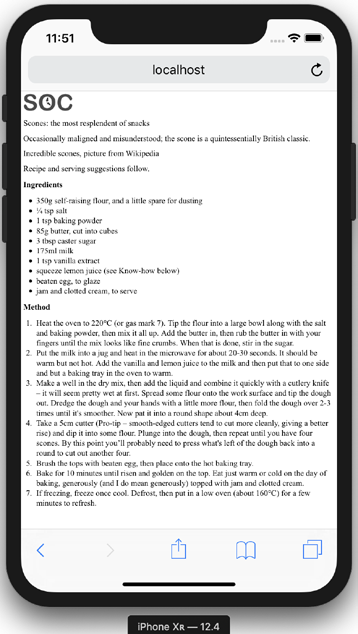
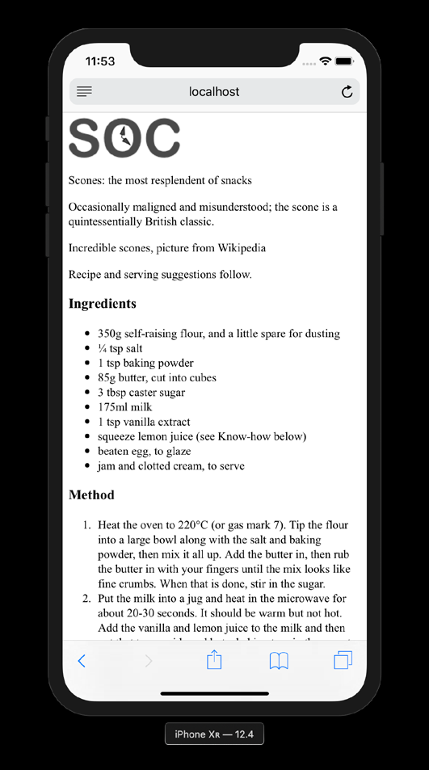
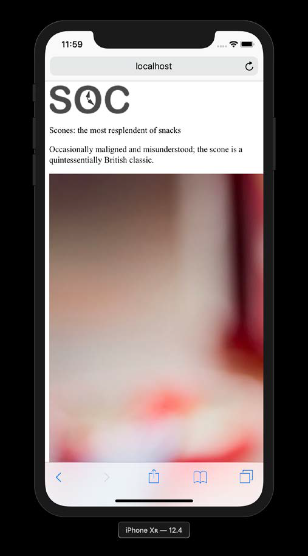
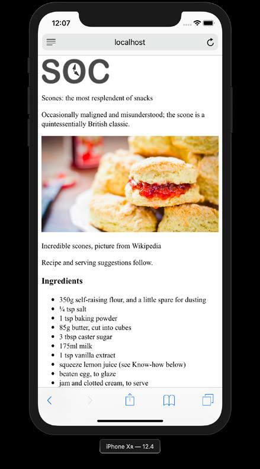
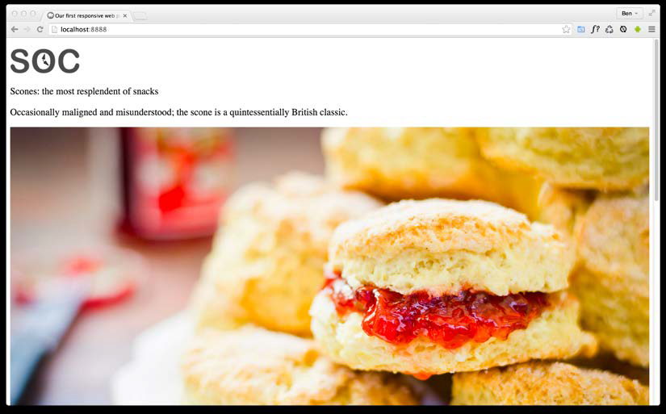
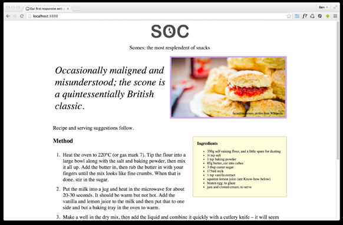
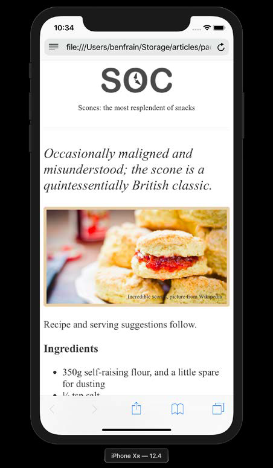

## The Essentials of Responsive Web Design

* In 2012, responsive web design was
  a new and exciting possibility to address the needs of the ever-growing list of devices
  that could access the internet.
* In 2020 it's simply the de facto standard.
* Unless you  have a good reason, if you're building a website or web application and it isn't
  responsive, you're probably doing it wrong!

We will cover in this chapter:

* The browser and device landscape
* Defining responsive web design
* Setting browser support levels
* A brief discussion on development tools and text editors
* Our first responsive example: a simple HTML5 page
* The viewport meta tag
* Fluid images
* Writing CSS3 media queries to make pages adapt
* The shortfalls in our basic example
* Why our journey has only just begun

### The browser and device landscape

* Less than 10 years ago, it was reasonable to build a website at a fixed width.
* This fixed width (typically 960px wide or thereabouts) wasn't too wide for laptop
  screens, and users with large resolution monitors merely had an abundance of space
  on either side.
* But in 2007, Apple's iPhone ushered in the first truly usable phone browsing
  experience, and the way people access and interact with the web changed forever.
* In 2012, the following was noted about percentage of total browser usage by device type:

>> "In the 12 months from July 2010 to July 2011, global mobile browser use had risen
from 2.86 ot 7.02 percent."

*  After was noted:
>> "As these words are written, in mid 2014, the same statistics system
gs.statcounter.com reports that figure has risen to 29.48% (by way of comparison,
North America's mobile figure is at 24%). It's a rising trend that shows no sign
of abating."


In 2019, mobile accounts for a whopping 51.11% of total browser usage, desktop 45.18%, and
tablet 3.71%.

*The indisputable fact is that the number of people using smaller-screen devices to
view the internet is growing at an ever-increasing rate, whilst at the other end of the
scale, 27- and 30-inch displays are now also commonplace (along with various tablet
and console devices).

* There is now more of a difference between the smallest screens
  browsing the web and the largest than ever before.
* A responsive web design, built with HTML and CSS allows a website to "just
  work" across multiple devices and screens. It enables the layout and capabilities
  of a website to respond to their environment (screen size, input type, and device/
  browser capabilities).
* Originally, before responsive web design was a thing, it was not uncommon for
  businesses to have a separate mobile site with its own unique URL.
* That was something
  that required detecting the user-agent on the host server before sending the browser to
  the relevant desktop or mobile URL.
* Another bonus with a responsive website is that it
  can be implemented without the need for server-based/backend solutions.

### Defining responsive web design

* The term "responsive web design" was coined by Ethan Marcotte in 2010.
* In his seminal A List Apart article http://www.alistapart.com/articles/responsiveweb-
  design he consolidated three existing techniques (flexible grid layout, flexible
  images/media, and media queries) into one unified approach and named it
  responsive web design.

#### Responsive web design in a nutshell


* In its infancy, it was typical for responsive design to be implemented by starting
  with a fixed-width desktop design before trying to scale the design down as needed
  for smaller screens.
* Namely, that everything from design to content management and
  development worked better when starting with the smallest screens first, and then
  "progressively enhancing" the design and content for larger screens and/or more
  capable devices.
* 
There are a few subjects I'd like to address and get
squared away before we continue: browser support, text editors, and tooling.

##### Browser support
* The sheer volume of disparate devices that access the web means most people
  understand the need for technical solutions that cater for most devices.

* The popularity and ubiquity of responsive web design usually makes the approach
  an easy sell to clients and stakeholders.
* Nowadays, most people have some idea  what responsive web design is about, even if that understanding amounts to little
  more than "a website that looks good on phones as well as computers."

* Before considering any web project it makes sense to decide, in advance, what
  platforms you need to fully support and which you are happy to concede visual/
  functional anomalies for.
* To this end, if you aren't already, become familiar with websites such as http://
  caniuse.com. Can I use provides a simple interface for establishing the browser
  support for each web platform feature.
* Generally speaking, when starting a project, as a simple and broad way to determine
  what browsers to support, I apply the following crude piece of logic: if the cost of
  developing and supporting browser X is more than the revenue/benefit created by
  the users of browser X, don't develop specific solutions for browser X.

##### Text editors
* It makes no difference what tool you use to write your code. If the simplest of
text editors allows you to write your HTML, CSS, and JavaScript efficiently, that's
absolutely fine.

##### Tools for software development

* Similarly, there are no requisite tools that are essential to get a responsive web
  design out of the door.
* you should be aware that there are many, often
  free, tools available to eliminate many of the manual and time-intensive tasks of
  building websites.
* Linting and validation tools can check your HTML, JavaScript, and CSS code against
  standards as you work, eliminating many time-wasting errors that are the result of
  nothing more than a typo.
* More recently, code formatters have changed the way we
  work day to day. Tools like Prettier, for example, automatically format your code
  with indentation and spacing when you save. None of these tools are essential but
  they may afford you some benefits.
* New tools come out constantly and they are continually evolving. Therefore, whilst
  some relevant and beneficial tools will be mentioned by name as we go, be aware
  that something better may be just around the corner.

### Our first responsive example

I promised that by the end of this chapter you would know all
you needed to build a fully responsive web page.

* You can download all the code samples from this book by visiting
  https://rwd.education/.

#### Our basic HTML file

* We will start with a simple HTML5 structure.
* For now, concentrate on the elements inside the `<body>` tag. There we have a few
  div elements, a graphic for a logo, a paragraph or two of text, and a list of items.
* However, what you should know is that the text is a recipe and description of how
  to make scones—a quintessentially British dessert.

````html
<!DOCTYPE html>
<html class="no-js" lang="en">
  <head>
  <meta charset="utf-8" />
  <title>Our first responsive web page with HTML5 and CSS3</title>
  <meta name="description" content="A basic responsive web page –
  an example from Chapter 1" />
  <link rel="stylesheet" href="css/styles.css" />
  </head>
  <body>
    <div class="Header">
      <a href="/" class="LogoWrapper"></a>
      <p class="Strap">Scones: the most resplendent of snacks</p>
    </div>
    <div class="IntroWrapper">
        <p class="IntroText">Occasionally maligned and misunderstood;
            the scone is a quintessentially British classic.</p>
        <div class="MoneyShot">
            <p class="ImageCaption">Incredible scones, picture from
                 Wikipedia</p>
        </div>
    </div>
    <p>Recipe and serving suggestions follow.</p>
    <div class="Ingredients">
        <h3 class="SubHeader">Ingredients</h3>
        <ul></ul>
    </div>
    <div class="HowToMake">
        <h3 class="SubHeader">Method</h3>
         <ol class="MethodWrapper"></ol>
    </div>
  </body>
</html>
````

* By default, web pages are inherently flexible. If I open the example page, even as
  it is at this point, with no special work done to make it responsive, and resize the
  browser window, the text reflows as needed.
* What about on different devices? Again, with no CSS whatsoever added to the page,
  this is how that renders on an iPhone XR:


* As you can see, it's rendering, but like a desktop page shrunken down to fit the space
  available. The reason for that is that iOS renders web pages at 980px wide by default
  and shrinks them down into the "viewport."
* Before responsive design was a thing, it was commonplace to see websites render
  like that on an iPhone. Nowadays, thanks to the ubiquity of responsive web design,
  they are as rare as rocking horse droppings!

>> The area of a browser window that allows a web page to be viewed
is known technically as the viewport. To be clear, the viewport area
excludes the browser toolbars, URL bar, and so on. From now on,
we will generally use this more accurate term.

We can make the page more mobile-friendly by adding this snippet in the `<head>`:

````html
<meta name="viewport" content="width=device-width,initial-scale=1.0"/>
````
* This viewport meta tag is the non-standard, but de facto, way of telling the browser
  how to render the page.
* Although introduced to the web by Apple, rather than a
  standards process, it remains essential for responsive web design.
* For now, you just need to know that in this case, our viewport meta tag is effectively
  saying "make the content render at the width of the device."
* In fact, it's probably easier to just show you the effect this line has on applicable
  devices:

  Great! Another snag fixed; the text is now rendering and flowing at a more "native
  size."

#### Taming Images

* That nice big image (2000px wide) is forcing our page to render more than a little
wonky. We clearly need to fix that.

* We could add a fixed width to the image via CSS but the problem there
  is that we want the image to scale to different screen sizes. For example, in CSS, our
  iPhone XR is 414px wide by 896px high. If we set a width of 414px to that image,
  what happens if a user rotates the screen? On this device, the 414px wide viewport
  is now 896px wide.
* Thankfully, it's pretty easy to achieve fluid images with a single
  line of CSS.
* I'm going to create the `css/styles.css` CSS file now that's already linked in the
  head of the HTML page.
* In our blank styles.css file, here is the first thing I'm adding.
````css
  img {
      max-width: 100%;
  }
````


With that file saved and the page refreshed, we see something more akin to what we
might expect.



* All this max-width based rule does is stipulate that all images should grow to be a
  maximum of 100% of their size.
* Where a containing element (such as the body or
  a div it sits within) is less than the full intrinsic width of the image, the image will
  simply scale up to display as large as it can within that constraint.

#### A brief tangent on width/max-width for images

* To make images fluid, you could also use the more widely used width property.
* When a property of width is
  used, then the image will be displayed at that `width`, relative to its container if using
  percentages, regardless of its own inherent size.
* The result in our example would be
  that the logo (also an image) would stretch beyond its intrinsic size to fill 100% of its
  container.
* With a container far wider than the image, as is the case with our logo, this
  leads to a massively oversized image.


However, if we look at the page in larger viewports, the basic styles start to get both
literally and figuratively stretched. Take a look at the example page at a size of
around 1400px:



* Oh, dear! In fact, even at around 800px wide it's starting to suffer. Around this point,
  it would be handy if we could rearrange a few things. Maybe resize the image and
  position it off to one side. Perhaps alter some font sizes and background colors of
  elements.
* Thankfully, we can achieve all this functionality quite easily by employing CSS
  media queries to bend things to our will.

#### Enter media queries

* We'll use CSS media queries at this point to adjust
  the layout depending upon the screen width.
* For now, all you need
  to appreciate is that media queries are directives in CSS that allow us to isolate CSS
  rules to certain environmental conditions; the size of the screen in this instance.

##### Breakpoints

* The term "breakpoint" is web developer vernacular for defining a particular viewport
  width or height at which a responsive design should change significantly.
* When people first started making use of media queries, it was common to see
  designs built with specific breakpoints to cater to the popular devices of the day. At
  the time, it was typically iPhone (320px × 480px) and iPad (768px × 1024px) devices.
* That practice was a bad decision then, and it would be an even worse one now. The problem is that doing that caters a design to specific screen sizes.
* We want  a responsive design—something that is agnostic of the screen size viewing it,
  responding to any size viewport it finds itself in, not something that only looks at its
  best at specific sizes.
* For the purpose of whipping our basic example into shape, however, we will
  concentrate on just one type of media query: a minimum width media query.
* CSS rules within this type of media query only get applied if the viewport is or exceeds
  a certain width.
* The exact minimum width can be specified using a raft of different
  length units, including percent, em, rem, and px. In CSS, a minimum width media
  query is written like this:

````css
  @media screen and (min-width: 800px) {
    /* styles */
  }
````

* The `@media` directive tells the browser we are starting a media query, the `screen`
  part (declaring screen is technically not needed in this situation but we will deal
  with that in detail in Chapter 3, Media Queries – Supporting Differing Viewports) tells
  the browser these rules should be applied to all screen types.
  We then have the `and` keyword, which chains together another set of conditionals, which in this case is
 ` (min-width: 800px)`. That tells the browser that the rules should also be limited
  to all viewports at least 800px wide.
>> "The absence of support for media queries is in fact the first media query."

* What he meant by that is that the first rules we write outside of a media query should be our starter or "base"
  rules for the most basic devices, which we then enhance for more capable devices
  and larger screens.
* The basic styles are written first. It is only
  when we need to do something different that we introduce a media query.
* This approach also facilitates a "smallest screen first" mentality and allows us
  to progressively layer on detail as and when the design needs to change for
  bigger screens.


##### Amending the example for a larger screen

* We've already established that our design is starting to suffer at around 800px wide.
* Therefore, let's mix things up a little by way of a simple example of how we can lay
  things out differently at different viewport sizes.
* First off, we will stop that main "hero" image from getting too big and keep it over on
  the right. Then the intro text can sit to the left.
* We will then have the main portion of the text (the "method" that describes how
  to make the scones) on the left below, with a small boxed-out section detailing the
  ingredients over on the right.
* All these changes can be achieved relatively simply by encapsulating these
  specific styles within a media query. Here's what things look like with the relevant
  styles added:

* It still looks essentially the same as it did before on smaller screens but adjusts to the
  new layout if the viewport is 800px or wider.
* Here are the layout styles that were added:

````css
@media screen and (min-width: 800px) {
  .IntroWrapper {
    display: table;
    table-layout: fixed;
    width: 100%;
  }

  .MoneyShot,
  .IntroText {
    display: table-cell;
    width: 50%;
    vertical-align: middle;
    text-align: center;
  }
  .IntroText {
    padding: 0.5rem;
    font-size: 2.5rem;
    text-align: left;
  }
  .Ingredients {
    font-size: 0.9rem;
    float: right;
    padding: 1rem;
    margin: 0 0 0.5rem 1rem;
    border-radius: 3px;
    background-color: #ffffdf;
    border: 2px solid #e8cfa9;
  }
  .Ingredients h3 {
    margin: 0;
  }
}
````

* With only minimal code we have built a page that
  responds to the viewport size and offers a preferable layout as needed. By adding
  just a few more styles things look even easier on the eye.
* With those in place, our basic responsive page now looks like this on an iPhone:


*This has been a very basic example but it has encapsulated the essential methodology
of building out a responsive web design.


Let's just go over the important parts of what we have covered in this chapter and in
this basic example again:
* Use whatever text editor you like
* Tools exist to make writing code easier but don't get hung up on what to use
* Responsive designs are made possible with a flexible layout, fluid images,
and media queries
* A meta tag is needed in the head of your HTML so a browser knows how
to render the page
* You'll want all images to be set with a max-width of 100% in the CSS by
default
* A breakpoint is just a point, typically a screen-width, at which we use a
media query to alter the design
* When you write CSS for a responsive design, start with base styles that
can work on any device—typically the smallest screen and then use media
queries to adapt it for larger screens

#### The shortcomings of our example
* We've covered all the essential component parts of building a basic
  responsive web page with HTML and CSS.
* We need to cover typography, color, shadows, and hover styles; semantic markup;
  accessibility concerns; animation; scalable graphics; forms; and so much more!


### Summary
* you now know and understand the essential elements needed to
  create a fully responsive web page
* However, as we have just discovered, there
  are plenty of places where things could be improved.
* In the next chapter, Chapter 2, Writing HTML Markup, we are going to take a
  deep dive into HTML5 markup. HTML is the very skeleton of any web page or
  application, the bedrock on which to build anything meaningful, the oxygen a
  website breathes, the...