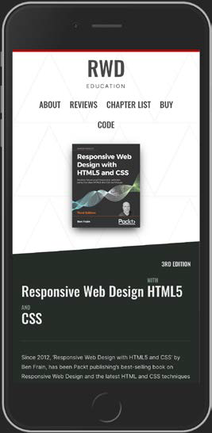
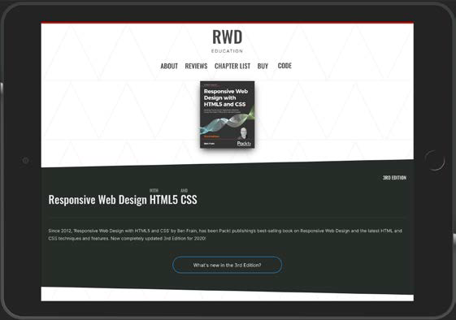

## Media Queries – Supporting Differing Viewports

* This chapter will look in detail at CSS media queries, hopefully providing all that's
  needed to fully understand their capability, syntax, and future development.
* we will use media queries to adjust the basic layout of our test site,
  adding relevant styles for wider screen sizes.


You will see that the design looks acceptable on devices with slim viewports, such as
mobile phones:




Little stretched when you widen the browser window:

  


* The initial styles are written using a fluid/proportional approach.
* This means widths are generally written as percentages rather than fixed pixel sizes - the upshot being
  that the content at least grows and shrinks to fill the browser window regardless of
  how large or small it gets.
* Media queries allow us to target specific CSS styles depending upon the capabilities
  of a device.
* With just a few lines of CSS we can change the way
  content is displayed based upon things such as viewport width, screen aspect ratio,
  orientation (landscape or portrait), and so on.

In this chapter, we will:

* Understand the use of the viewport meta tag to make media queries work
on mobile devices
* Learn why media queries are essential for a responsive web design
* Understand the media query syntax
* Learn how to use media queries in links, in @import statements, and within
CSS files
* Understand what device features we can test for
* Consider whether to author similar media queries in one block or wherever
it suits
* Consider the latest capabilities added in Media Queries Level 4 that we can
use today—media features like pointer, hover, and prefers-color-scheme

### The viewport meta tag

* When Apple released the iPhone in 2007, they introduced a proprietary meta tag
  called the viewport meta tag.
* Its purpose was to provide a way for web pages to
  communicate to mobile browsers how they would like the web browser to render
  the page.
* Without this meta tag, iPhones would render web pages as a 980px wide window
  that the user would then have to zoom in or out of.
* With this meta tag, it's possible to render a web page at its actual size and then
  adapt the layout to provide the kind of web page we now all expect to see when
  we browse the internet on our phones.
* As you are now aware, the viewport <meta> tag is added within the <head> tags
  of the HTML.
* It can be set to a specific width (which we could specify in pixels, for
  example) or as a scale, for example, 2.0 (twice the actual size).

````html
    <meta name="viewport" content="initial-scale=2.0,width=device-width"/>
````

* The `name="viewport"` attribute tells the browser this tag is dealing with the viewport.
* The `content="initial-scale=2.0` section is then saying, "scale the content to twice
  the size" (where 0.5 would be half the size, 3.0 would be three times the size, and so
  on)
* the `width=device-width` part tells the browser that the width of the page
  should be equal to device-width.
* The `<meta>` tag can also be used to control the amount a user can zoom in and out of the page.
`````html
    <meta name="viewport" content="width=device-width, maximum-scale=3, minimum-scale=0.5" />
`````
* You could also disable users from zooming at all:
````html
    <meta name="viewport" content="initial-scale=1.0, user-scalable=no"/>
````

* Change the scale to 1.0, which means that the mobile browser will render
  the page at 100 percent of its viewport.
* Setting it to the device's width means that our
  page should render at 100 percent of the width of all supported mobile browsers.
* For the majority of responsive web design cases, this <meta> tag would be appropriate:
````html
    <meta name="viewport" content="width=device-width,initial-scale=1.0"/>
````


### Why media queries are needed for a responsive web design

* The official introduction to what media queries are all about founded in W3C specification of the CSS3 media queries module  (http://www.w3.org/TR/css3-mediaqueries/):

>> "A media query consists of a media type and zero or more expressions that check
for the conditions of particular media features. Among the media features that can
be used in media queries are 'width', 'height', and 'color'. By using media queries,
presentations can be tailored to a specific range of output devices without changing
the content itself."

* Fluid layout, created with percentages rather than fixed widths, can carry
  a design a substantial distance, given the gamut of screen sizes we have to cover.
* There are times when we need to revise the layout more substantially. 
* Media queries make this possible—think of them as basic conditional logic for CSS.

#### Basic conditional logic in CSS

* True programming languages all have some facility in which one of two or more
  possible situations is catered for. This usually takes the form of conditional logic,
  also known as "control flow," typified by an if/else statement.

* At the time of writing, CSS does not facilitate true conditional logic or programmatic
  features. Loops, functions, iteration, and complex math are still the sole domain of
  CSS preprocessors
* Media queries are one mechanism that allows us to author basic conditional logic—styles applied depending upon
  whether certain media-based conditions are met.


### Media query syntax

How media query works and what does a CSS media query look like?

* Following is a complete but simple web page with no content but some basic styles
  and media queries:
````html
    <!DOCTYPE html>
    <html class="no-js" lang="en">
    <head>
        <meta charset="utf-8" />
        <title>Media Query Test</title>
        <meta name="viewport" content="width=device-width, initialscale=1.0"/>
    <style>
        body {
            background-color: grey;
        }
        @media screen and (min-width: 320px) {
            
            body {
                background-color: green;
            }
        }
        @media screen and (min-width: 550px) {
        
            body {
                background-color: yellow;
            }
        }
        
        @media screen and (min-width: 768px) {
            
            body {
                background-color: orange;
            }
        }
        @media screen and (min-width: 960px) {
            
            body {
                background-color: red;
            }
        }
    </style>
    </head>
    <body></body>
    </html>
````

* Open the file in a browser and resize the window. The background color of the
  page will vary depending upon the current viewport size.
* A default color is defined first, outside of a media query; when any of the media
  queries are true, the styles inside the media query overwrite the default.
* You use the `@media` at-rule to communicate a media query and then write the media test in
  parenthesis. The test must pass in order for the styles within the curly braces to
  be applied.

Ways to write media query:

* You can write media queries in links in HTML—to load particular style sheets
  if the media query passes.
* You can write media queries on CSS @import at-rules to determine which style sheets should be imported.
* Write media queries directly into a CSS file to determine which rules should be applied on the
  basis of which media queries resolve to true.

#### Media queries in link tags

Example of a media query looks like on a link you'd find in the `<head>` section of
markup:

`````html
<link rel="stylesheet" media="screen and (orientation: portrait)" href="portrait-screen.css" />
`````

This media query is asking "Are you a screen and is your orientation portrait?".


#### Media query on an `@import` at-rule

The same rule on an `@import` statement:
````css
    @import url("portrait-screen.css") screen and (orientation:portrait);
````

You can see all the same component parts there—the file to be loaded, and the test
that has to be passed. Different syntax, same outcome.

#### Media queries in a CSS file

The same media query written inside a CSS file, or, within a style tag
inside the HTML:

````css
@media screen and (orientation: portrait) {
/* styles here */
}
````


#### Inverting media query logic

* It's possible to reverse the logic of any media query expression by adding not to the
  beginning of the media query.

````html
<link rel="stylesheet" media="not screen and (orientation:portrait)" href="portrait-screen.css" />
````

* Although using the `not` keyword is occasionally useful, I find it is far simpler to
  just think about applying styles when you do want them. This way, you can stick
  to writing the tersest and simplest forms of media queries.

#### Combining media queries

* It's also possible to string multiple expressions together.

Let's extend one of our prior examples and also limit the file to devices that have a viewport
greater than 800 pixels:

````html
<link rel="stylesheet" media="screen and (orientation: portrait) and (min-width: 800px), print" href="800wide-portrait-screen.css" />
````

* A comma separates each media query, effectively acting like an or command.
* You'll notice that after print, there is no trailing and or feature/value combination in parentheses. That's because in
  the absence of these values, the media query is applied to all media types.

#### Everyday media queries

* In most situations, you don't actually need to specify screen.
>> "A shorthand syntax is offered for media queries that apply to all media types; the
keyword 'all' can be left out (along with the trailing 'and'). I.e. if the media type is
not explicitly given it is 'all'."

* Therefore, unless you want to target styles to particular media types, just leave the
  `screen` `and` part out.

````html
@media (min-width: 750px) {
/* styles */
}
````

#### What can media queries test for?

* When building responsive designs, the media queries that get used most usually
  relate to a device's viewport width (width).

Here is a list of all capabilities that Media Queries Level 3 can test for.


* width: The viewport width.
* height: The viewport height.
* device-width: The rendering surface's width (for our purposes, this is
typically the screen width of a device).
* device-height: The rendering surface's height (for our purposes, this is
typically the screen height of a device).
* orientation: This capability checks whether a device is portrait or
landscape in orientation.
* aspect-ratio: The ratio of width to height based upon the viewport width
and height. A 16:9 widescreen display can be written as aspect-ratio: 16/9.
* device-aspect-ratio: This capability is similar to aspect-ratio but is
based upon the width and height of the device rendering surface, rather
than viewport.
* color: The number of bits per color component. For example, min-color:
16 will check that the device has 16-bit color.
* color-index: The number of entries in the color lookup table (the table
is how a device changes one set of colors to another) of the device. Values
must be numbers and cannot be negative.
* monochrome: This capability tests how many bits per pixel are in a
monochrome frame buffer. The value would be a number (integer),
for example, monochrome: 2, and cannot be negative.
* resolution: This capability can be used to test screen or print resolution; for
  example, min-resolution: 300dpi. It can also accept measurements in dots
  per centimeter; for example, min-resolution: 118dpcm.
* scan: This can be either progressive or interlace features largely particular to
  TVs. For example, a 720p HDTV (the p part of 720p indicates "progressive")
  could be targeted with scan: progressive, while a 1080i HDTV (the i part
  of 1080i indicates "interlaced") could be targeted with scan: interlace.
* grid: This capability indicates whether or not the device is grid- or itmapbased.


All the preceding features, with the exception of scan and grid, can be prefixed with
min or max to create ranges.

````css
@import url("tiny.css") screen and (min-width:200px) and (maxwidth:360px);
````
* Here, a minimum (min) and maximum (max) have been applied to width to set
  a range.
* The tiny.css file will only be imported for screen devices with a minimum
  viewport width of 200 pixels and a maximum viewport width of 360 pixels.

### Using media queries to alter a design

* I'd suggest opening the index.html file and the associated styles.css file from
  the start folder of this chapter's code.
* Then add some media queries to alter some
  areas of the page at certain viewport widths.
* Let's make a couple of changes together
  and then you can practice some of your own.


We need to keep the design as it is for smaller viewports but amend it for larger
ones.

* Let's start by adding a media query that makes the navigation links and the
  logo sit either side at 1200px and above:

````html
@media (min-width: 1200px) {
  .rwd-MastHead {
    flex-direction: row;
    justify-content: space-between;
    max-width: 1000px;
    margin: 0 auto;
  }
}
````

* What we are saying is, "apply this rule, but only at a minimum width of 1200px."

Let's write another media query to fix that. We'll make this change at a slightly
smaller screen width:

````html
@media (min-width: 1000px) {
  .rwd-Nav {
    margin: 0;
    padding: 0;
  }
}
````

In this instance, we are saying, "above 1000px, make the margin and padding zero
for the .rwd-Nav element."

* By writing our "base" styles as we have, outside of any media query, our actual
  media queries only need to encapsulate the differences needed.

* there are emulators for Android and a simulator for iOS (for the pedantic, a simulator merely simulates the relevant
  device whereas an emulator actually attempts to interpret the
  original device's code)

* The Android emulator for Windows, Linux, and Mac is available for free by installing Android Studio
  from https://developer.android.com/studio

* The iOS simulator is only available to macOS users and comes as part of
  the Xcode package (free from the Mac App Store).

* Browsers themselves are also including ever-improving tools for
  emulating mobile devices in their development tools. Both Firefox
  and Chrome currently have specific settings to emulate different
  mobile devices/viewports.

### Advanced media query considerations

#### Organizing media queries

* The browser needs to fetch and parse a linked CSS file before the rendering of the page
  can complete.
* This stands to reason as the browser needs to know what styles to
  apply for laying out and painting the page.
* However, modern browsers are smart enough to discern which style sheets, (linked
  with media queries in the head) need to be analyzed immediately and which can
  be deferred until after the initial page rendering.
* The upshot of this is that for these
  browsers, CSS files that are linked with media queries that don't apply to the current
  environmental situation can be "deferred" until after the initial page load, providing
  some performance advantage.

* To reiterate, all the linked files will still be downloaded; they just may not necessarily
require the browser to hold the rendering of the page.

* Therefore, a modern browser loading a responsive web page with four different
  style sheets linked with different media queries (to apply different styles for different
  viewport ranges) will download all four CSS files but probably only parse the
  applicable one initially before rendering the page.

* You can look in the network area and check that all files are downloaded, regardless
  of whether the media queries are actually being applied.

#### The practicalities of separating media queries


* There is rarely a great tangible advantage in separating different media query styles into separate
  files.

* Using separate files increases the number of HTTP requests needed
  to render a page, which in turn can make pages slower in certain other situations.

* More practically, only once I am certain all images are compressed, all scripts are
  concatenated and minified, all assets are being served gzipped, all static content is
  being cached via CDNs, and all surplus CSS rules have been removed would I start
  looking to split up media queries into separate files for potential performance gains.

#### Nesting media queries "inline"

* I recommend adding media queries within an
  existing style sheet alongside the "normal" rules.
* Should media queries be declared underneath the associated selector? Or split off into a separate block of code at the end for all
   alike media queries?


#### Combine media queries or write them where it suits?

* I'm a fan of writing media queries underneath the original "normal" rule.

Let's say I want to change the width of a couple of different elements, which
are written at different places in the style sheet, depending upon the viewport width.
I would typically do this:
````css
  .thing {
    width: 50%;
  }
  @media (min-width: 30rem) {
    .thing {
        width: 75%;
    }
  }
  /* A few more styles would go between them */
  .thing2 {
    width: 65%;
  }
  @media (min-width: 30rem) {
    .thing2 {
    width: 75%;
    }
  }
````

* Can you see in this example, we have two separate media queries written testing for
  the same thing: @media (min-width: 30rem)


* You should grouping all the like media queries into a single block like this:

````css
.thing {
width: 50%;
}
.thing2 {
width: 65%;
}
@media (min-width: 30rem) {
.thing {
width: 75%;
}
.thing2 {
width: 75%;
}
}
/* A few more styles go after */
````

* That is certainly one way to do it. However, from a maintenance point of view
  I find this more difficult.
* My preference is to define a rule for an individual selector once and have any variations of that rule
  (such as changes within media queries) defined immediately after.
* if you want to author your media queries directly after the
  original rule but have all alike media queries definitions merged into one, there are
  a number of build tools (at the time of writing Grunt and Gulp both have relevant
  plugins) that facilitate this.

#### Media Queries Level 4

* Specifications at the W3C go through a ratification process, from **Working Draft
  (WD)**, to **Candidate Recommendation (CR)**, to **Proposed Recommendation
  (PR)**, before finally arriving, many years later, at **W3C Recommendation (REC)**.


* So in this section, we will concentrate on Media Queries Level 4 features that we can make use of—features already implemented
  in browsers.

##### Interaction media features

* Interaction media queries are concerned with pointing devices and hover capability.

###### The pointer media feature

Here is the W3C introduction to the pointer media feature:

>> "The pointer media feature is used to query about the presence and accuracy
of a pointing device such as a mouse. If a device has multiple input mechanisms,
the pointer media feature must reflect the characteristics of the "primary" input
mechanism, as determined by the user agent."

There are three possible states for the `pointer` features: `none`, `coarse`, and `fine`.

* A `coarse` pointer device might be a finger on a touch screen device. However, it
  could equally be a cursor from a games console that doesn't have the fine-grained
  control of something like a mouse

````css
  @media (pointer: coarse) {
  /* styles for when coarse pointer is present */
  }
````

* A `fine` pointer device might be a mouse but could also be a stylus pen or any future
  fine-grained pointer mechanism:
````css
  @media (pointer: fine) {
    /* styles for when fine pointer is present */
  }
````

The safest bet is always to assume users are using touch-based
input and to size user interface elements accordingly. 

That way, even if they are using a mouse they will have no difficulty using the
interface with ease. 

If however you assume mouse input and don't provide affordance for coarse pointers, it might make for a difficult
user experience.

###### The hover media feature

* The `hover` media feature tests a device's ability to hover over
  elements on the screen.
* If the user has multiple inputs at their disposal (touch and
  mouse, for example), characteristics of the primary input are used.

For users that have no ability to hover, we can target styles at them with a value
of none:

````css
@media (hover: none) {
/* styles for when the user cannot hover */
}
````

we might choose to make the non-hover scenario the default and then
only add hover styles for devices that take advantage of them:

````css
@media (hover) {
  /* styles for when user can hover */
}
````

* Be aware that there are also `any-pointer` or `any-hover` media features.
* They are like the preceding `hover` and `pointer` but test the capabilities of any of the possible
  input devices.

if you want to apply styles if any input device is capable of hover,
regardless of whether that input device is the primary one:

````css
@media (any-hover: hover) {
/* styles if any input device is capable of hover*/
}
````

If you wanted to style an element a certain way based upon whether any attached
pointer device was coarse, you could use `any-pointer` like this:

````css
@media (any-pointer: coarse) {
/* styles to be applied if any attached pointer is coarse */
}
````


##### The prefers-color-scheme media feature

* Popular operating systems for both desktop and mobile computers have given users the option of a "dark mode."
* To supplement this, operating systems expose this user preference to the browser by way of the
  `prefers-color-scheme` media feature.
* At present there are three possible preferences: `light`, `dark`, and `no-preference`.

To demonstrate this feature's use, we might amend the default colors for a page
like this:

`````css
  body {
    background-color: #e4e4e4;
    color: #545454;
  }
  @media (prefers-color-scheme: dark) {
    body {
      background-color: #333;
      color: #ddd;
    }
}
`````

* I'm recommending you to write your default "mobile" styles in the
  root of your style sheet in.
* I would recommend writing the default colors in the root too
  and add one of these queries to cater for an alternative interface if needed or desired.

You can read the draft specification for the `prefers-color-scheme` media feature
here: https://drafts.csswg.org/mediaqueries-5/#prefers-color-scheme.


### Summary

* We've learned what media queries are, why we need them, and how
  to include them in our CSS files.
* We've also learned how to use the viewport meta
  tag to make browsers render pages in the manner we'd like.
* Back in Chapter 1, `The Essentials of Responsive Web Design` we noted that the three
  tenets of responsive web design are `media queries`, `flexible layouts`, and `flexible
  media`. We're three chapters in and we've only covered media queries
* In Chapter 4, `Fluid Layout, Flexbox, and Responsive Images`, we are going to take a deep
  dive into fluid layouts and images.
* We will cover how to convert a fixed-width design into a fluid proportional layout before laying out page elements with Flexbox.
