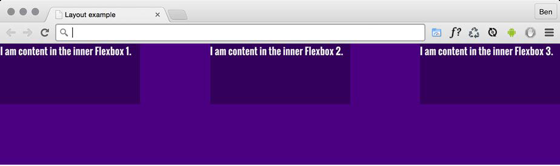

## Fluid Layout, Flexbox, and Responsive Images


The three core tenets of responsive web design are:

* fluid layout, 
* media queries
* flexible media

Now we know how to wield `media queries` to change a layout at a particular
"breakpoint."

* We will focus on the other two pillars of responsive web design: `fluid
  layout` and `flexible media`.
* We will be able to ensure any designs we code can flex easily between breakpoints, responding to the confines of
  their container.


* (late 1990s), websites were typically built with their widths defined as percentages.
* These percentage-based widths fluidly adjusted to the screen and were known as fluid layouts.

* In the mid-to-late 2000s, there was an intervening fixation on fixedwidth
  designs.
* Nowadays, as we build responsive web designs, we need to look
  back to fluid layouts and remember all the benefits they offer.

We now have two powerful CSS layout mechanisms at our disposal: `CSS Flexbox` and `CSS Grid`.

* Flexbox is so useful because it can do more than merely provide a fluid layout
  mechanism.


In this chapter, we will:
* Learn how to convert fixed pixel layouts to proportional sizes
* Consider existing CSS layout mechanisms and their shortfalls
* Recognize Flexbox as a practical path beyond these limitations
* Understand the Flexible Box Layout Module and the benefits it offers
* Learn how to use responsive images and srcset for resolution switching
and art direction

Let's converting fixed designs into fluid relationships. This is a task that you'll need to perform constantly when building responsive web
designs.

### Converting a fixed pixel design to a fluid proportional layout

* Graphic composites exported from a program such as Photoshop, Illustrator, or Sketch all have fixed pixel dimensions.
* Designs need to be converted to proportional dimensions when recreating
  the design as a fluid layout for the browser.

The father of responsive web design, Ethan Marcotte, create a beautifully simple formula for making this conversion

in his 2009 article, `Fluid Grids` (http://alistapart.com/article/FLUIDGRIDS):

                        target / context = result


* Put another way, divide the units of the thing you want by the thing it lives in.
* Understanding it will enable you to convert any fixed dimension layouts into responsive/fluid equivalents.


Consider a very basic page layout intended for desktop.

Here's an image of the layout:


* The layout is 960px wide.
* Both the header and footer are the full widths of the layout.
* The left-hand area is 200px wide.
* The right-hand area is 100px wide.
* That leaves 660px for the main content area.


We need convert this fixed-width design into a fluid layout that retains its proportions as it is resized.

* First, convert the middle and side sections into proportional dimensions.

Converting the left-hand side:

* The left-hand side is 200 units wide. Our target value.
* Divide this target size by 960 units, our context.
* This result in .208333333.

That gives us a value that is the target value described as a percentage of its parent. (20.8333333%)

Converting the middle section:

* Our target value is 660.
* Divide that by our context of 960 and we get .6875.
* This result in 68.75%.

Converting the right-hand side:

* Our target is 100.
* Divide that by the context of 960 and we get .104166667.
* This result in 10.4166667%.

To prove the point, let's quickly build that basic layout as blocks in the browser.

Here is the HTML that you can view the layout as `example_04-01`.
````html
<div class="Wrap">
    <header class="Header"></header>
    <div class="WrapMiddle">
        <aside class="Left"></aside>
        <main class="Middle"></main>
        <aside class="Right"></aside>
    </div>
    <footer class="Footer"></footer>
</div>
````
And here is the CSS:

````css
html,
body {
    margin: 0;
    padding: 0;
}

.Wrap {
    max-width: 1400px;
    margin: 0 auto;
}

.Header {
    width: 100%;
    height: 130px;
    background-color: #038c5a;
}
.WrapMiddle {
    width: 100%;
    font-size: 0;
}

.Left {
    height: 625px;
    width: 20.83%;
    background-color: #03a66a;
    display: inline-block;
}
.Middle {
    height: 625px;
    width: 68.75%;
    background-color: #bbbf90;
    display: inline-block;
}

.Right {
    height: 625px;
    width: 10.41%;
    background-color: #03a66a;
    display: inline-block;
}

.Footer {
    height: 200px;
    width: 100%;
    background-color: #025059;
}
````

If you open the example code in a browser and resize the page, you will see that the
dimensions of the `.Left`, `.Middle`, and `.Right` sections remain proportional to one
another.

Let's consider how we would have the same content on a smaller screen that
flexes to a point and then changes to the layout we have already seen.

* The idea is that, for smaller screens, we will have a single "tube" of content.
* The lefthand area will only be viewable as an "off-canvas" area; typically, an area for a menu
  or similar, which sits off the viewable screen area and slides in when a menu button
  is pressed.
* The main content sits below the header, then the right-hand section below
  that, and finally the footer area.
* We can expose the left-hand menu area by clicking anywhere on the header.


* Combining this with our newly mastered media query skills, we can adjust the viewport and the design just "responds"—effortlessly
  moving from one layout to another and stretching between the two.

Here is the CSS properties as example of left-hand section founded in `example_04-02`.

````css
.Left {
    height: 625px;
    background-color: #03a66a;
    display: inline-block;
    position: absolute;
    left: -200px;
    width: 200px;
    font-size: 0.9rem;
    transition: transform 0.3s;
}
@media (min-width: 40rem) {
    .Left {
        width: 20.83%;
        left: 0;
        position: relative;
    }
}
````

* Without a media query, is the small screen layout.
* For larger screen sizes, the width becomes proportional, the positioning relative, and the
  left value is set to zero.

We have combined two of the core responsive web design techniques we have covered; converting fixed dimensions to proportions and using
media queries to target CSS rules relevant to the viewport size.

* We have covered the essentials of fluid design.
* To summarize, where needed,
  make the dimensions of elements proportional rather than fixed.

### Why do we need Flexbox?

* We are now going to explore using `CSS Flexible Box Layout`, or `Flexbox` as it is more
  commonly known.
* We will be prudent to first consider the shortfalls of existing layout techniques, such as `inline-block`, `floats`,
  and `tables`.

#### Inline-block and white-space

* The biggest issue with using inline-block as a layout mechanism is that it renders a
  space between HTML elements.
* It does require a few hacks to remove the space when it's unwanted.
* Read to this article by the irrepressible Chris Coyier: http://css-tricks.com/fighting-the-spacebetween-
   inline-block-elements/.
* It's also worth pointing out that there is no simple way to vertically center content
  within an inline-block.
* Using inline-block, there is also no way of having two sibling
  elements where one has a fixed width and another fluidly fills the remaining space.

#### Floats

Floats work everywhere fairly consistently. However, there are two major irritations.
* When specifying the width of floated elements in percentages, their computed
  widths don't get rounded consistently across browsers.
* Sections will drop down below others when not intended, and at other times they can leave an irritating gap at one side.
* you usually have to "clear" the floats so that parent boxes/elements don't
  collapse.
* It's easy enough to do this, but it's a constant reminder that floats were
  never intended to be used as a robust layout mechanism.

#### Table and table-cell

* Don't confuse `display: table` and `display: table-cell` with the equivalent
  HTML elements.
* These CSS properties merely mimic the layout of their HTMLbased
  brethren.
* They in no way affect the structure of the HTML.

Using `display: table` with a `display: table-cell` child enabled consistent
and robust vertical centering of elements.

* `table-cell` elements inside `table` elements space themselves perfectly; they don't suffer rounding issues like floated
  elements.
* Generally, it's necessary to wrap an extra element
  around items to get perfect vertical centering.
* It's also not possible to wrap items set as display: table-cell
  on to multiple lines.


In conclusion, all of the existing layout methods have severe limitations.

### Introducing Flexbox

Flexbox addresses the shortfalls in each of the aforementioned display mechanisms.

Brief overview of features:

* It can easily vertically center contents.
* It can change the visual order of elements.
* It can automatically space and align elements within a box, automatically
assigning available space between them.
* Items can be laid out in a row, a row going in the reverse direction, a column
down the page, or a column going in reverse order up a page.
* It can make you look 10 years younger (probably not, but in low numbers
  of empirical tests (me), it has been proven to reduce stress).

#### The bumpy path to Flexbox

Flexbox has been through a few major iterations before arriving at the stable version
we have today.

Consider changes:  
* In 2009 version (http://www.w3.org/TR/2009/WD-css3-flexbox-20090723/)
* In 2011 version (http://www.w3.org/TR/2011/WD-css3-flexbox-20111129/)
* In 2014 version (http://www.w3.org/TR/css-flexbox-1/) basing our examples.
  
    
These differing specifications mean there have been three major implementations across browsers.


##### Leave prefixing to someone else

Writing Flexbox code to gain the widest possible browser support is a tough task
by hand.

I'm going to set three Flexbox-related properties and
values. Consider this:

````css
.flex {
    display: flex;
    flex: 1;
    justify-content: space-between;
}
````

* That's how the properties and values would look in the official syntax.
* If we want support for Android browsers (v4 and below) and IE 10, here is what
  would actually be needed:

````css
.flex {
    display: -webkit-box;
    display: -webkit-flex;
    display: -ms-flexbox;
    display: flex;
    -webkit-box-flex: 1;
    -webkit-flex: 1;
    -ms-flex: 1;
    flex: 1;
    -webkit-box-pack: justify;
    -webkit-justify-content: space-between;
    -ms-flex-pack: justify;
    justify-content: space-between;
}
````
* I'd rather spend my time doing something more
  productive than writing out that little lot each time.
* If you want or need the broadest level of browser support for Flexbox, take the time to set up an
  autoprefixing solution.

###### Choosing your autoprefixing solution

* Use some form of automatic prefixing solution to accurately and easily add vendor prefixes to CSS;
* I favor Autoprefixer  (https://github.com/postcss/autoprefixer). It's fast, easy to set up, and
  very accurate.
* There are versions of Autoprefixer for most setups; you don't necessarily need a
  command line-based build tool (such as Gulp or Grunt)
* There are also  versions of Autoprefixer for Atom, Brackets, Visual Studio Code, and more.


##### Getting Flexy

Flexbox has four key characteristics: 
* direction, 
* alignment, 
* ordering, 
* flexibility.

We'll cover all of these characteristics and how they relate to each other by way of
a few examples.

    The examples are deliberately simplistic; we are just moving some boxes and their 
    content around so that we can understand the principles of how Flexbox works.


###### Perfect vertically centered text

Note that this first Flexbox example is example_04-03:


Here's the markup:

````html
<div class="CenterMe">
Hello, I'm centered with Flexbox!
</div>
````
Here is the entire CSS rule that's styling that markup:

````css
.CenterMe {
    background-color: indigo;
    color: #ebebeb;
    font-family: 'Oswald', sans-serif;
    font-size: 2rem;
    text-transform: uppercase;
    height: 200px;
    display: flex;
    align-items: center;
    justify-content: center;
}
````

The majority of the property/value pairs in that rule are merely setting the colors
and font sizes. The three properties we are interested in are:

````css
.CenterMe {
    /* other properties */
    display: flex;
    align-items: center;
    justify-content: center;
}
````

Let's consider what each one does:

* `display: flex`: This is the bread and butter of Flexbox. This merely sets
the item to be a Flexbox, as opposed to a block or inline-block.
* `align-items`: This aligns the items within a Flexbox in the cross axis,
vertically centering the text in our example.
* `justify-content`: This sets the main axis, centering the content. With
a Flexbox row, you can think of it as the button in a word processor that sets the
text to the left, right, or center (although there are additional `justify-content`
values we will look at shortly).


###### Offset items

How about a simple list of navigation items, but with one offset to one side?
Here's what it looks like:


Here's the markup:

````html
<div class="MenuWrap">
<a href="#" class="ListItem">Home</a>
<a href="#" class="ListItem">About Us</a>
<a href="#" class="ListItem">Products</a>
<a href="#" class="ListItem">Policy</a>
<a href="#" class="LastItem">Contact Us</a>
</div>
````

And here is the CSS:

````css
.MenuWrap {
    background-color: indigo;
    font-family: 'Oswald', sans-serif;
    font-size: 1rem;
    min-height: 2.75rem;
    display: flex;
    align-items: center;
    padding: 0 1rem;
}
.ListItem,
.LastItem {
    color: #ebebeb;
    text-decoration: none;
}
.ListItem {
    margin-right: 1rem;
}
.LastItem {
    margin-left: auto;
}
````

* When you set `display: flex`; on a wrapping element, the children of that element
  become flex items, which then get laid out using the flex layout model.
* The magical
  property here is `margin-left: auto`, which makes that item use all of the available
  margin on that side.


###### Reverse the order of items

Want to reverse the order of the items?


* It's as easy as adding `flex-direction: row-reverse`; to the wrapping element;
* changing `margin-left: auto` to `margin-right: auto` on the offset item:

````css
.MenuWrap {
    background-color: indigo;
    font-family: 'Oswald', sans-serif;
    font-size: 1rem;
    min-height: 2.75rem;
    display: flex;
    flex-direction: row-reverse;
    align-items: center;
    padding: 0 1rem;
}
.ListItem,
.LastItem {
    color: #ebebeb;
    text-decoration: none;
}
.ListItem {
    margin-right: 1rem;
}
.LastItem {
    margin-right: auto;
}
````

###### How about if we want them laid out vertically instead?

Change to `flex-direction: column`; on the wrapping element and
remove the `auto margin`:

````css
.MenuWrap {
    background-color: indigo;
    font-family: 'Oswald', sans-serif;
    font-size: 1rem;
    min-height: 2.75rem;
    display: flex;
    flex-direction: column;
    align-items: center;
    padding: 0 1rem;
}
.ListItem,
.LastItem {
    color: #ebebeb;
    text-decoration: none;
}
````


###### Column reverse

Want them stacked in the opposite direction? Just change to` flex-direction: column-reverse`; and you're done.


* There is a `flex-flow` property that is shorthand for setting
`flex-direction` and `flex-wrap` in one go.
* For example, `flex-flow: row wrap`; would set the direction to a row and
  set the wrapping on.
* The `flex-wrap` property is also absent from the oldest Flexbox implementations, so it can
  render the whole declaration void in certain browsers.


##### Different Flexbox layouts with media queries

Flexbox is inherently flexible, so how about we go for a column list of items at smaller viewports and a row style layout when space allows?

Do you remember the header of the https://rwd.education website
we started?

````css
.rwd-MastHead {
    display: flex;
    flex-direction: column;
}
@media (min-width: 1200px) {
    .rwd-MastHead {
        flex-direction: row;
        justify-content: space-between;
        max-width: 1000px;
        margin: 0 auto;
    }
}
````

* We set the content to flow in a column down the page, with the logo
  and navigation links one below the other.
* At a minimum width of 1200px, we make those elements display as a row, one at either side.
* The space between them is provided by the justify-content property.

###### Inline-flex

* Flexbox has an inline variant to complement `inline-block` and `inline-table`.


Here's the markup:

````html
<p>
    Here is a sentence with a
    <a
    href="http://www.w3.org/TR/css-flexbox-1/#flex-containers"
    class="InlineFlex"
    >inline-flex link</a>.
</p>
````

And, using the same basic styles as the previous examples for the fonts, font size and
colors, here is the CSS needed:

````css
.InlineFlex {
    display: inline-flex;
    align-items: center;
    height: 120px;
    padding: 0 4px;
    background-color: indigo;
    text-decoration: none;
    border-radius: 3px;
    color: #ddd;
}
````

* When items are set as `inline-flex` anonymously, which happens if their parent
  element is not set to `display: flex`, then they retain whitespace between elements,
  just like `inline-block` or `inline-table` do.
* If they are within a flex
  container, then whitespace is removed, much as it is with CSS `table-cell` items within
  a CSS table.

###### Flexbox alignment properties

If you want to play with this example, you can find it at example_04-07.

* The important thing to understand with Flexbox alignment is the concept of the
  axis.
* There are two axes to consider, the "main axis" and the "cross axis."


* If the direction of your Flexbox is set to row, the main axis will be the horizontal axis
  and the cross axis will be the vertical axis.
* If your Flexbox direction is set to column, the main axis will be the
  vertical axis and the cross axis will be the horizontal axis.

The specification (http://www.w3.org/TR/css-flexbox-1/#justify-contentproperty)
provides the following illustration to aid authors:


Here's the basic markup of our example:

````html
<div class="FlexWrapper">
    <div class="FlexItem">I am content in the inner Flexbox.</div>
</div>
````


Let's set a few basic Flexbox-related styles:

````css
.FlexWrapper {
    background-color: indigo;
    display: flex;
    height: 200px;
    width: 400px;
}
.FlexItem {
    background-color: #34005b;
    display: flex;
    height: 100px;
    width: 200px;
}
````
In the browser, that produces this:


Let's test drive the effects of some of these properties.

###### The align-items property

* The align-items property positions items in the cross axis.


Applying this property to our wrapping element:

```css
.FlexWrapper {
    background-color: indigo;
    display: flex;
    height: 200px;
    width: 400px;
    align-items: center;
}
````

The item within that box gets centered vertically:


The same effect would be applied to any number of children within.


###### The align-self property

* Sometimes, you may want to pull just one item into a different alignment.
* Individual flex items can use the align-self property to align themselves.


So, here's the HTML:

````html
<div class="FlexWrapper">
    <div class="FlexItem">I am content in the inner Flexbox 1</div>
    <div class="FlexItem AlignSelf">I am content in the inner Flexbox 2</div>
    <div class="FlexItem">I am content in the inner Flexbox 3</div>
</div>
````

And here is the CSS:

````css
.FlexWrapper {
    background-color: indigo;
    display: flex;
    height: 200px;
    width: 400px;
}
.FlexItem {
    background-color: #34005b;
    display: flex;
    height: 100px;
    width: 200px;
}
.AlignSelf {
    align-self: flex-end;
}
````

Here is the effect in the browser:


In that example, the value of `align-self` was set to `flex-end`. 

Let's consider the possible values we could use
on the cross axis before looking at alignment in the main axis.


For cross-axis alignment, Flexbox has the following possible values:

* `flex-start`: Setting an element to flex-start would make it begin at the
"starting" edge of its flex container.
* `flex-end`: Setting to flex-end would align the element at the end of the flex
container.
* `center`: This puts it in the middle of the flex container.
* `baseline`: This sets all the flex items in the container so that their baselines
align.
* `stretch`: This makes the items stretch to the size of their flex container
(in the cross axis).

There are some particulars inherent to using these properties.
If something
isn't playing happily, always refer to the specification for any edge case scenarios:
http://www.w3.org/TR/css-flexbox-1/#align-items-property.

###### The justify-content property

* Alignment in the main axis is controlled with `justify-content`.

Possible values for `justify-content` are:

* flex-start
* flex-end
* center
* space-between
* space-around


The first three do exactly what you would now expect.

However, let's take a look at what space-between and space-around do. Consider this markup:

````html
<div class="FlexWrapper">
    <div class="FlexItem">I am content in the inner Flexbox 1.</div>
    <div class="FlexItem">I am content in the inner Flexbox 2.</div>
    <div class="FlexItem">I am content in the inner Flexbox 3.</div>
</div>
````
Consider this CSS:
* We are setting the three `div` elements with a class
  of `FlexItem` to each be 25% width.
* wrapped by a flex container, with a class of
  FlexWrapper, set to be 100% width.

`````css
.FlexWrapper {
    background-color: indigo;
    display: flex;
    justify-content: space-between;
    height: 200px;
    width: 100%;
}
.FlexItem {
    background-color: #34005b;
    display: flex;
    height: 100px;
    width: 25%;
}
`````

* As the three items will only take up 75% of the available space, justify-content
  explains what we would like the browser to do with the remaining space.
* A value of space-between puts an equal amount of space between the items;
* A value of space-around puts it around the items.

A screenshot using space-between:


A screenshot using space-around::


The other alignment property I find myself using from time to time is `space-evenly`.
This takes the available space and adds an equal amount to every gap.


###### The flex property

It's also possible to define the width, or "flexiness," if you will, with the `flex` property.

Consider another example with the same markup, but an amended CSS for the items:

````css
.FlexItem {
    border: 1px solid #ebebeb;
    background-color: #34005b;
    display: flex;
    height: 100px;
    flex: 1;
}
````

* The `flex` property is actually a shorthand way of specifying three separate
  properties: `flex-grow`, `flex-shrink`, and `flex-basis`.
* The specification covers these individual properties in more detail here: http://www.w3.org/TR/cssflexbox-
  1/#flex-components.
* The specification recommends that authors use the flex shorthand property;


* For items within a flex container, if a `flex` property is present, it is used to size the
  item rather than a `width` or `height` value (if also present).
* Even if the width or height
  value is specified after the `flex` property, it will still have no effect.
* It is important to note that if the item you are adding the flex property
  to is not a flex item, the `flex` property will have no effect.

Let's look at what each of these flex properties actually does:

* `flex-grow` (the first value you can pass to flex) is the amount, in relation
to the other flex items, the flex item can grow when free space is available.
* `flex-shrink` is the amount the flex item can shrink, in relation to the other
flex items, when there is not enough space available.
* `flex-basis` (the final value you can pass to flex) is the basis size the flex
item is sized to.

 

* It's possible to just write `flex: 1`, and have that interpreted to mean
  `flex: 1 1 0`,I recommend writing all the values into a flex shorthand property
  yourself.

Example: `flex: 1 1 auto`
* means that the item will grow into one part of the
available space.
* It will also shrink one part when space is lacking
* the basis size for the flexing is the intrinsic width of the content (that is, the size the content would
  be if flex wasn't involved).


Example: `flex: 0 0 50px`
* means this item will neither grow nor shrink;
* basis is 50px (so it will be 50px regardless of any free space).

Example: `flex: 2 0 50%`
* That's going to take two "lots" of available space;
* it won't shrink;
* basis size is 50%.

If you set the `flex-shrink` value to zero, then the `flex-basis` value effectively
behaves like a minimum width.


With each flex item set to 1, they each take up an equal amount of space


To test the theory, let's amend the HTML classes in the markup.

*We're adding FlexOne, FlexTwo, and FlexThree to each item in turn:

````html
<div class="FlexWrapper">
    <div class="FlexItem FlexOne">I am content in the inner Flexbox 1.</div>
    <div class="FlexItem FlexTwo">I am content in the inner Flexbox 2.</div>
    <div class="FlexItem FlexThree">I am content in the inner Flexbox 3.</div>
</div>
````
Let's remove the previous styles related to FlexItem and instead add this:

````css
.FlexItem {
    border: 1px solid #ebebeb;
    background-color: #34005b;
    display: flex;
    height: 100px;
}
.FlexOne {
    flex: 1.5 0 auto;
}
.FlexTwo,
.FlexThree {
    flex: 1 0 auto;
}
````
In this instance, FlexOne takes up 1.5 times the amount of space that FlexTwo and
FlexThree take up.


* This shorthand syntax really becomes useful for quickly bashing out relationships
  between items.
* If a request comes in, such as "that needs to be 1.8
  times wider than the others," you could easily facilitate that request with the flex
  property.

##### Simple sticky footer

* Suppose you want a footer to sit at the bottom of the viewport when there is not
  enough content to push it there.
* This has always been a pain to achieve, but with
  Flexbox it's simple.

````html
<body>
  <div class="MainContent">
    Here is a bunch of text up at the top. But there isn't enough
    content to
    push the footer to the bottom of the page.
  </div>
  <div class="Footer">
    However, thanks to flexbox, I've been put in my place.
  </div>
</body>
````

And here the CSS:

````css
html,
body {
  margin: 0;
  padding: 0;
}
html {
  height: 100%;
}
body {
  font-family: 'Oswald', sans-serif;
  color: #ebebeb;
  display: flex;
  flex-direction: column;
  min-height: 100%;
}
.MainContent {
  flex: 1 0 auto;
  color: #333;
  padding: 0.5rem;
}
.Footer {
  background-color: violet;
  padding: 0.5rem;
}
````

* Adding more content into MainContent div, when there is not enough content, the footer is stuck to the
  bottom of the viewport. When there is enough, it sits below the content.
* This works because our flex property is set to grow where space is available.
* As our body is a flex container of 100% minimum height, the main content can grow into all
  of that available space.


##### Changing the source order

* Flexbox has visual source reordering built-in.

Consider this markup:

````html
<div class="FlexWrapper">
<div class="FlexItem FlexHeader">I am content in the Header.</div>
<div class="FlexItem FlexSideOne">I am content in the SideOne.</div>
<div class="FlexItem FlexContent">I am content in the Content.</div>
<div class="FlexItem FlexSideTwo">I am content in the SideTwo.</div>
<div class="FlexItem FlexFooter">I am content in the Footer.</div>
</div>
````

We will add some simple colors to more easily
differentiate the sections, and just get these items one under another in the same
order they appear in the markup:

````css
.FlexWrapper {
  background-color: indigo;
  display: flex;
  flex-direction: column;
}
.FlexItem {
  display: flex;
  align-items: center;
  min-height: 6.25rem;
  padding: 1rem;
}
.FlexHeader {
  background-color: #105b63;
}
.FlexContent {
  background-color: #fffad5;
}
.FlexSideOne {
  background-color: #ffd34e;
}
.FlexSideTwo {
  background-color: #db9e36;
}
.FlexFooter {
  background-color: #bd4932;
}
````

That render in the browser like this:


Now, suppose we want to switch the order of `FlexContent` to be the first item,
without touching the markup.

````css
.FlexContent {
background-color: #fffad5;
order: -1;
}
````

* The order property lets us revise the order of items within a Flexbox simply
  and sanely.
* In this example, a value of -1 means that we want it to be before
  all the others.
* If you want to switch items around quite a bit, I'd recommend being a little more
  declarative and add an order number for each item.


Let's suppose we want our main content at the beginning of a document. In this
example, our markup looks like this: 

* You can view this finished example at example_04-09.

````html
<div class="FlexWrapper">
<div class="FlexItem FlexContent">I am content in the Content.</
div>
<div class="FlexItem FlexSideOne">I am content in the SideOne.</
div>
<div class="FlexItem FlexSideTwo">I am content in the SideTwo.</
div>
<div class="FlexItem FlexHeader">I am content in the Header.</div>
<div class="FlexItem FlexFooter">I am content in the Footer.</div>
</div>
````

* First is the page content, then our two sidebar areas, then the header, and finally the
  footer.
* We can structure the HTML in the order that makes
  sense for the document, regardless of how things need to be laid out visually.

After some basic styling for each `FlexItem`, for the smallest screens (outside of any
media query), I'll go with the following order:


````css
.FlexHeader {
background-color: #105b63;
order: 1;
}
.FlexContent {
background-color: #fffad5;
order: 2;
}
.FlexSideOne {
background-color: #ffd34e;
order: 3;
}
.FlexSideTwo {
background-color: #db9e36;
order: 4;
}
.FlexFooter {
background-color: #bd4932;
order: 5;
}
````
That gives us this in the browser:


We can move the items in visual order with a single property


And then, at a breakpoint, I'm switching to this:

````css
@media (min-width: 30rem) {
.FlexWrapper {
flex-flow: row wrap;
}
.FlexHeader {
width: 100%;
}
.FlexContent {
flex: 1 0 auto;
order: 3;
}
.FlexSideOne {
width: 150px;
order: 2;
}
.FlexSideTwo {
width: 150px;
order: 4;
}
.FlexFooter {
width: 100%;
}
}
````

That gives us this in the browser:


* The shortcut `flex-flow: row wrap` has been used.
* `flex-flow` is actually a shorthand property of sorts that lets you set two properties in one:
`flex-direction` and `flex-wrap`.
* We've `used flex-direction` already to switch between rows and columns and to
  reverse elements.


##### Wrapping with flex

* By default, items in a flex container will shrink to fit and, if they can't, they will
  overflow the container.

Consider this markup:


````html
<div class="container">
  <div class="items">Item 1</div>
  <div class="items">Item 2</div>
  <div class="items">Item 3</div>
  <div class="items">Item 4</div>
</div>
````

And this CSS:

`````css
.container {
  display: flex;
  width: 500px;
  background-color: #bbb;
  align-items: center;
  border: 1px solid #111;
}
.items {
  color: #111;
  display: inline-flex;
  align-items: center;
  justify-content: center;
  font-size: 23px;
  flex: 0 0 160px;
  height: 40px;
  border: 1px dashed #545454;
}
`````


Because there is a width of only 500px on the flex container, those four elements
don't fit:


However, those items can be set to wrap with `flex-wrap: wrap`. This wraps the
items once they hit the edge of the container.

* There will be times when you want flex items to wrap and other
  times when you don't.
* Remember that the default is to not wrap, but you can easily
  make the change with a single line.
* Remember that you can set the wrapping by itself with flex-wrap, or as part
  of the flex-flow direction and wrap shorthand.

Consider this list of paragraphs in the following image. At this width, they are not easy to read.


Let's amend that layout with a media query and a few choice flex properties.

````css
@media (min-width: 1000px) {
.rwd-Chapters_List {
display: flex;
flex-wrap: wrap;
}
.rwd-Chapter {
flex: 0 0 33.33%;
padding: 0 20px;
}
.rwd-Chapter::before {
left: -20px;
}
}
````

And that produces this effect in the browser:


* We made the container of the chapters into a flex container.
* To stop the elements scrunching up into one another, we set the container to wrap.
* To limit the chapter section widths to a third of the container, we used the flex shorthand to set
  33.33% as the flex-basis and prevented the element from growing or shrinking.
* Padding was used to provide a little space between them.
* The final small tweak
  was to bring in the chapter numbers a little.

##### Wrapping up Flexbox

* There are near endless possibilities when using the Flexbox layout system and, due
  to its inherent "flexiness," it's a perfect match for responsive design.
* If you've never
  built anything with Flexbox before, all the new properties and values can seem
  a little odd, and it's sometimes disconcertingly easy to achieve layouts that have
  previously taken far more work.
* The other modern layout system we have in CSS is Grid, but that's a topic for next chapter.

#### Responsive images

* Serving the appropriate image to users based on the particulars of their device and
  environment has always been a tricky problem.
* This problem was accentuated with the advent of responsive web design; the very nature of which is to serve a single
  code base to each and every device.

##### The inherent problem of responsive images

* Only a browser knows the particulars of the device viewing a website: its screen size and device capabilities, for example.
* Only the people making the website know what versions of an image we have at our disposal.
* We may have three versions of the same image: small, medium, and large; each with increasing dimensions to cover off the
  anticipated screen size and screen density eventualities.
* Website authors, have only half of the solution, in that we know what images we have.
* The browser has the other half of the solution in that it knows what device is visiting the site and what the most
   appropriate image dimensions and resolution would be.

  
     How can we tell the browser what images we have at our disposal so that it may choose the most appropriate one for the user?

* In the first few years of responsive web design, there was no specified way.
* Now we have the Embedded content specification: https://html.spec.
  whatwg.org/multipage/embedded-content.html.
* The Embedded content specification describes ways to deal with the simple
  resolution switching of images—to facilitate a user on a higher resolution screen
  receiving a higher resolution version of images.


* It's not possible to appreciate
  on a single screen the different images that could be loaded with a particular syntax
  or technique.
* Let's look at the two most common scenarios you're likely to need responsive images
  for.
* These are switching one image for another when a different resolution is needed
  and changing an image entirely depending on the available viewport space.

##### Simple resolution switching with srcset

* Let's suppose you have three versions of the same image.
* One is a smaller size for smaller viewports, another caters for medium-sized viewports, and, finally, a larger
  version covers off every other viewport.
* Here is how we can let the browser know that we have these three versions available:

````html

````

* First of all, the src attribute, which you will already be familiar with, has a dual role
  here; it's specifying the small 1x version of the image, and it also acts as a fallback
  image if the browser doesn't support the srcset attribute.
* Older browsers that will ignore the srcset
  information will get the smallest and best-performing image possible.
* For browsers that understand srcset, with that attribute, we provide
  a comma-separated list of images that the browser can choose from.
* After the image name (such as scones_medium.jpg), we issue a simple resolution hint.
* In this example, 1.5x and 2x have been used but any integer
  would be valid.


* However, there is an issue here; a device with a 1440px wide, 1x screen will get the
  same image as a 480px wide, 3x screen. That may or may not be the desired effect.

##### Advanced switching with srcset and sizes

* In a responsive web design, it wouldn't be
  uncommon for an image to be the full viewport width on smaller viewports, but
  only half the width of the viewport at larger sizes.
* Here's how we can communicate these intentions to the browser:

````html

````

* Inside the image tag, we are utilizing srcset again
* However, this time, after specifying the images, we are adding a value with a w suffix.
* This tells the browser how wide the image is.
* In our example, we have a 450px wide image (called sconessmall.jpg) and a 900px wide image (called scones-medium.jpg).
* It's important to note this w-suffixed value isn't a "real" size. It's merely an indication to the browser,
  roughly equivalent to the width in "CSS pixels."


* This w-suffixed value makes more sense when we factor in the sizes attribute.
* The `sizes` attribute allows us to communicate the intentions for our images to the
  browser.
* In our preceding example, the first value is equivalent to "for devices that
  are at least 280px wide, I intend the image to be around 100vw wide."


* For devices that are at least 640px wide, I only intend the image to be shown at 50vw."
* That may seem a little redundant until you factor in DPI (or DPR for device pixel ratio).
* For example, on a 320px wide device with a 2x resolution (effectively requiring a 640px wide image,
  if shown at full width), the browser might decide the 900px wide image is actually
  a better match as it's the first option it has for an image that would be big enough
  to fulfill the required size.

###### Did you say the browser "might" pick one image over another?

* An important thing to remember is that the values given in the sizes attribute are
  merely hints to the browser.
* That doesn't necessarily ensure that the browser will
  always obey.
* It means that, in the future,
  if there is a reliable way for browsers to ascertain network conditions, it may choose
  to serve one image over another because it knows things at that point that we can't
  possibly know at this point as the author.
* Perhaps a user has a setting on their device
  to "only download 1x images" or "only download 2x images." In these scenarios, the
  browser can make the best call.
* The alternative to the browser deciding is to use the `picture` element. Using this
  element ensures that the browser serves up the exact image you asked for.


##### Art direction with the picture element

The final scenario you may find yourself in is one in which you have different images
that are applicable at different viewport sizes.


For example, consider our cake-based
example again from Chapter 1. Maybe on the smallest screens we would like a closeup
of the scone with a generous helping of jam and cream on top. For larger screens,
perhaps we have a wider image we would like to use. Perhaps it's a wide shot of a
table loaded up with all manner of cakes. Finally, for larger viewports still, perhaps
we want to see the exterior of a cake shop on a village street with people sat outside
eating cakes and drinking tea (I know, sounds like nirvana, right?).


We need three different images that are most appropriate at different viewport
ranges. Here is how we could solve this with picture:


````html
<picture>
  <source media="(min-width: 480px)" srcset="cake-table.jpg" />
  <source media="(min-width: 960px)" srcset="cake-shop.jpg" />
  
</picture>
````

* First of all, be aware that when you use the `picture` element, it is merely a wrapper
  to facilitate other images making their way to the img tag within.
* If you want to style
  the images in any way, it's the img tag that should get your attention.
* Secondly, the `srcset` attribute here works exactly the same as the previous example.
* Thirdly, the `img` tag provides your fallback image and also the image that will be
  displayed if a browser understands picture but none of the media definitions
  match. Just to be crystal clear, do not omit the `img` tag from within a `picture`
  element or things won't end well.
* The key difference with `picture` is that we have a `source` tag.
* Here, we can use
  media query-style expressions to explicitly tell the browser which asset to use in
  a matching situation.
* For example, our first one in the preceding example is telling
  the browser, "Hey you, if the screen is at least 480px wide, load in the cake-table.jpg
  image instead." As long as the conditions match, the browser will dutifully obey.


###### Facilitate new image formats

* As a bonus, `picture` also facilitates us providing alternate formats of an image.
* "WebP" is a newer image format, pushed by Google that Apple's Safari browser
  lacks support for (check whether that is still the case at http://caniuse.
  com/#search=WebP)
* It provides a comparable quality as a JPG, but in a far smaller
  payload.
* So, if a browser supports it, it makes sense to let them have that version of
  the image instead.
* For browsers that support it, we can offer a file in that format and
  a more common format for those that don't:

````html
<picture>
<source type="image/webp" srcset="scones-baby-yeah.webp" />

</picture>
````

* Instead of the media attribute,
  we are using type, which, although more typically used to specify video sources
  (possible video source types can be found here: https://html.spec.whatwg.org/
  multipage/embedded-content.html#attr-source-type), allows us here to define
  WebP as the preferred image format.
* If the browser can display it, it will; otherwise,
  it will grab the default one in the img tag.

#### Summary

* We started by understanding how to
  create fluid layouts that can flex between the media queries we set.
* We then spent
  considerable time getting acquainted with Flexbox, learning how to solve common
  layout problems with relative ease.
* We have also covered how we can serve up any number of alternative images to our
  users depending on the problems we need to solve.
* By making use of `srcset`, `sizes`,
  and `picture`, our users should always get the most appropriate image for their
  needs—both now and in the future.
* Two great layout mechanisms arrived in CSS in relatively
  quick succession.Hot on the heels of the Flexible Box Layout Module was Grid
  Layout Module Level 1: http://www.w3.org/TR/css3-grid-layout/.
* Like Flexbox, CSS Grid means learning quite a bit of alien syntax.
