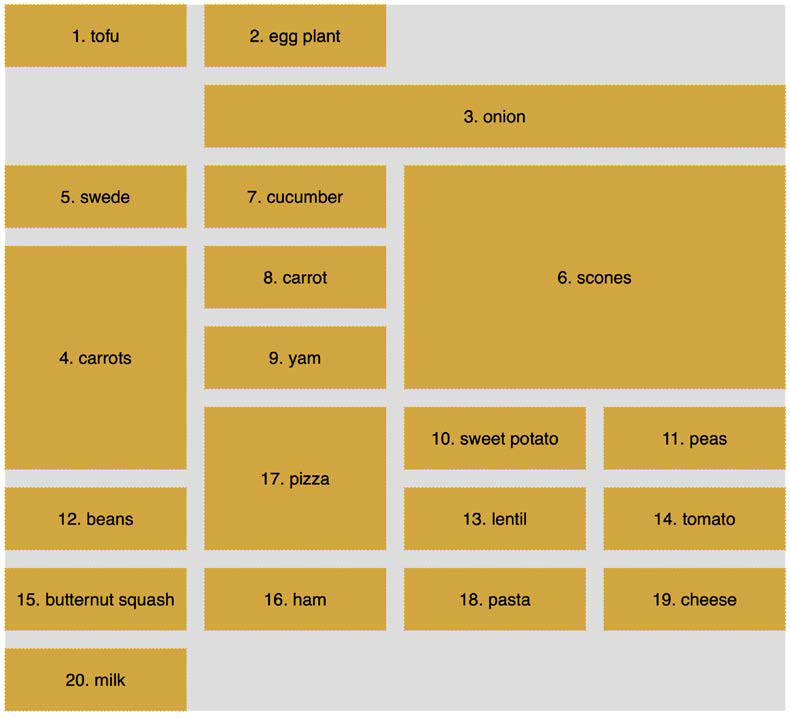

## Layout with CSS Grid

* The biggest "change" to CSS layout has been Grid.
* We now have a layout system capable of achieving everything we have done before
  with less code and more predictability.
* There are entirely new concepts to understand that have no real forebears in past CSS.

In this chapter, we will learn the following:
* What CSS Grid is and the problems it solves
* The essential concepts to understand when dealing with Grid layout
* Grid-specific terminology
* How to set up a grid
* How to position items in a grid
* How to create powerful responsive patterns with minimal code
* How to understand and write the grid shorthand syntax


### What CSS Grid is and the problems it solves

* CSS Grid is a two-dimensional layout system.
* Flexbox concerns itself with items being laid out in a single dimension/direction at a time.
* A Flexbox container either lays things out in a row, or it lays them out in a column.
* It cannot facilitate laying out items across and down at once; that is what
  Grid is for.

* When you adopt Grid, you don't have to forsake any other display methods.
* A Grid will quite happily allow a Flexbox inside it. Equally, part of your interface coded with Grid can quite happily live inside
  a Flexbox, standard block, or inline-block.


* There are times when using Grid is the most appropriate option, and there are
  times when Flexbox, or another layout method, is the most appropriate.
* We just haven't had a specific grid layout mechanism in CSS to do it.
* We have made use of blocks, floats, tables, and many other ingenious techniques to work around the fact we didn't have
  a proper grid layout system in CSS.
* Using CSS Grid, we can create grids of virtually infinite permutations and position
  child elements wherever we want them, regardless of their source order.
* Grid even makes provision for when additional items are added and adapts
  itself to the needs of the content.

#### Basic Grid syntax

In the most simple terms, to use Grid, we need to tell the browser:
* How many rows and columns our grid should have
* How those rows and columns should be sized
* Where we want to place the items of our grid
* What should happen when the size of the grid changes or more items are
added to the grid

#### Grid-specific concepts and terminology

* The first concept to understand is "explicit" and "implicit" item placement.
* The grid you define in your CSS with columns and rows is the `explicit` grid; it's the layout
  of the items you have explicitly defined.
* The `implicit` grid is the grid placement of items that happens when additional items you didn't foresee also get
  added to the grid.
* The placement of these new items is implied by the layout of your
  explicit grid.


* The next concept that commonly confuses people (it certainly did me) is that grid lines are on either side of the grid items.
* The bit in the middle, between the lines, is referred to as a grid "track."
* Where two tracks from different directions intersect is where a "grid area" is formed.
* A key takeaway is that when you place items within a grid, you can do so
  referencing the grid lines (which, therefore, implies a grid area) or the grid areas
  themselves if named.

### Setting up a grid

Here is the introduction to the explicit grid section of the W3C specification
(https://www.w3.org/TR/css-grid-1/#explicit-grids).

* It's worth rereading
  a few times as it is dense with essential information for understanding how the
  grid works:

> "The three properties grid-template-rows, grid-template-columns, and gridtemplate-
areas together define the explicit grid of a grid container. The final grid
may end up larger due to grid items placed outside the explicit grid; in this case
implicit tracks will be created, these implicit tracks will be sized by the grid-autorows
and grid-auto-columns properties.
> 
> The size of the explicit grid is determined by the larger of the number of rows/
columns defined by grid-template-areas and the number of rows/columns sized by
grid-template-rows/grid-template-columns.
> 
> Any rows/columns defined by grid-template-areas but not sized by grid-templaterows/
grid-template-columns take their size from the grid-auto-rows/grid-autocolumns
properties. If these properties don't define any explicit tracks the explicit
grid still contains one grid line in each axis.
> 
> Numeric indexes in the grid-placement properties count from the edges of the
explicit grid. Positive indexes count from the start side (starting from 1 for the
start-most explicit line), while negative indexes count from the end side (starting
from -1 for the end-most explicit line).
> 
> The grid and grid-template are properties that allow a shorthand to be used to set
all three explicit grid properties (grid-template-rows, grid-template-columns, and
grid-template-areas) at the same time. The grid shorthand also resets properties
controlling the implicit grid, whereas the grid-template property leaves them
unchanged."


Let's start our Grid journey in code with a very simple example. 

* First, the world's easiest grid layout: four numbered boxes. It will look like this in the browser:


Here is the markup:

````html
<div class="my-first-grid">
    <div class="grid-item-1">1</div>
    <div class="grid-item-2">2</div>
    <div class="grid-item-3">3</div>
    <div class="grid-item-4">4</div>
</div>
````

* The first thing I want you to consider is that with Grid, the markup pattern is a
  containing element, which is the grid; grid, and the elements of the grid are the direct
  children.
* Write the markup for grid child elements in the order that makes the most
  sense for the content;
* Grid can place them visually wherever you need it.

Here is the related CSS:


````css
.my-first-grid {
    display: grid;
    grid-gap: 10px;
    grid-template-rows: 200px 200px;
    grid-template-columns: 200px 200px;
    background-color: #e4e4e4;
}
.grid-item-1 {
    grid-row: 1;
    grid-column: 1;
}
.grid-item-2 {
    grid-row: 1;
    grid-column: 2;
}
.grid-item-3 {
    grid-row: 2;
    grid-column: 1;
}
.grid-item-4 {
    grid-row: 2;
    grid-column: 2;
}
[class^='grid-item'] {
    outline: 3px dashed #f90;
    font-size: 30px;
    color: #333;
}
````

* The parts to concentrate on in that CSS are the grid-specific properties.
* We use `display: grid` to set our container as a grid;
* We use `grid-template-rows: 200px 200px` to set two rows, each 200px high;
* We use `grid-template-columns: 200px 200px` to set the grid to have two 200px wide
  columns.
* We use `grid-row` with a number to tell Grid which row to place the item; and `grid-column` to tell it which column to place it in.
* Although our grid items belong to our grid, in this example, as they are all
  div elements, they are still computed as `display: block`.


Let's use the alignment properties we learned about in the last chapter to try
centering our grid items:

````css
.my-first-grid {
    display: grid;
    grid-gap: 10px;
    grid-template-rows: 200px 200px;
    grid-template-columns: 200px 200px;
    background-color: #e4e4e4;
    align-items: center;
    justify-content: center;
}
````

I expected to see the numbers perfectly centered in their respective grid tracks.


* We made a grid, with two columns and two rows, each 200px, and asked for the items to be both vertically and
  horizontally centered.
* Because we have used grid and not inline-grid, the grid
  fills the entire width of the page, despite the fact that our grid items don't need all
  that space.

Let's center the items inside their respective grid items.


````css
.my-first-grid {
    display: inline-grid;
    grid-gap: 10px;
    grid-template-rows: 200px 200px;
    grid-template-columns: 200px 200px;
    background-color: #e4e4e4;
}
[class^='grid-item'] {
    display: grid;
    align-items: center;
    justify-content: center;
    outline: 3px dashed #f90;
    font-size: 30px;
    color: #333;
}
````

* We switched our container to be an `inline-grid`, 
* set all the grid items to `display: grid`, 
* used the alignment properties `justify-content` and `align-items`.


That produces this result:


#### Explicit and implicit

* We discussed the difference between an explicit and implicit
  grid; an explicit grid being the structure you define in your CSS when setting up
  the grid. 
* When more content is placed in that grid than you provisioned for, the
  "implicit" grid comes into effect.


Let's look at that again by extending our prior example.
Let's add in another item and see what happens:

````html
<div class="my-first-grid">
    <div class="grid-item-1">1</div>
    <div class="grid-item-2">2</div>
    <div class="grid-item-3">3</div>
    <div class="grid-item-4">4</div>
    <div class="grid-item-5">5</div>
</div>
````
With that added, this is what we get in the browser:


* The grid has created implicit grid lines to create an implicit track
  for our new item.
* We didn't tell it what to do with that extra item, so it made
  the best guess.
* We can control how Grid handles items implicitly with the
  following properties: `grid-auto-rows` and `grid-auto-columns`.

##### grid-auto-rows and grid-auto-columns

Let's use `grid-auto-rows` and `grid-auto-columns` to make any extra grid items the
same size as the existing ones:

`````css
.my-first-grid {
    display: inline-grid;
    grid-gap: 10px;
    grid-template-rows: 200px 200px;
    grid-template-columns: 200px 200px;
    grid-auto-rows: 200px;
    grid-auto-columns: 200px;
    background-color: #e4e4e4;
}

`````

* Now, without writing any extra CSS, when additional items are placed in our grid,
  they get the 200px × 200px sizing we have defined.
* Here we have added another item in the DOM for a total of six:


You can even make patterns so that the first extra item is one size and the next is
another. The pattern gets repeated:

````css
.my-first-grid {
    display: inline-grid;
    grid-gap: 10px;
    grid-template-rows: 200px 200px;
    grid-template-columns: 200px 200px;
    grid-auto-rows: 100px 150px;
    grid-auto-columns: 100px 150px;
    background-color: #e4e4e4;
}
````


* The item 5 onwards uses the pattern we defined in the value of the
`grid-auto-rows` property.
* First, it is 100px tall, then 150px, and then back to 100px.


* You can see that the grid items are flowing vertically down the page.
* You can easily switch this to flow across the page instead using `grid-auto-flow`

##### grid-auto-flow

* The `grid-auto-flow` property allows you to define the direction that any implicitly
  added items flow inside the grid.
* Use a value of `column` when you want the grid to
  add extra columns to accommodate extra items;
* Use a value of `row` when you want the grid to add extra rows.


Let's amend our example by adding `grid-auto-flow: column` to make the items
flow across the page instead of down:


* There is an additional dense keyword that can be added to `grid-auto-flow: column dense` or `grid-auto-flow: row dense` – we'll look at that shortly.

### Placing and sizing grid items

So far, each item we have added to a grid has taken up a single grid area.

We are going to start a new example now (you can find it in the code as example_05-04).

* This grid will have 20 grid items; these are just random food items and their source
  order within their container as a number.
* Take a look at the code and the screenshot and see how much of it you can make sense of before
  reading on.
* It's also worth mentioning that I've purposely mixed up the use of whitespace in the
  values. You can write `grid-row: 6 / span 2` or `grid-row: 6/span 2`—either is
  just as valid. Just pick which you prefer.

Here's the markup:

````html
<div class="container">
  <div class="grid-item1">1. tofu</div>
  <div class="grid-item2">2. egg plant</div>
  <div class="grid-item3">3. onion</div>
  <div class="grid-item4">4. carrots</div>
  <div class="grid-item5">5. swede</div>
  <div class="grid-item6">6. scones</div>
  <div class="grid-item7">7. cucumber</div>
  <div class="grid-item8">8. carrot</div>
  <div class="grid-item9">9. yam</div>
  <div class="grid-item10">10. sweet potato</div>
  <div class="grid-item11">11. peas</div>
  <div class="grid-item12">12. beans</div>
  <div class="grid-item13">13. lentil</div>
  <div class="grid-item14">14. tomato</div>
  <div class="grid-item15">15. butternut squash</div>
  <div class="grid-item16">16. ham</div>
  <div class="grid-item17">17. pizza</div>
  <div class="grid-item18">18. pasta</div>
  <div class="grid-item19">19. cheese</div>
  <div class="grid-item20">20. milk</div>
</div>
````

Here is the CSS:

````css
.container {
  font-size: 28px;
  font-family: sans-serif;
  display: grid;
  gap: 30px;
  background-color: #ddd;
  grid-template-columns: repeat(4, 1fr);
  grid-auto-rows: 100px;
  grid-auto-flow: row;
}
[class^='grid-item'] {
  outline: 1px #f90 dashed;
  display: grid;
  background-color: goldenrod;
  align-items: center;
  justify-content: center;
}
.grid-item3 {
  grid-column: 2/-1;
}
.grid-item6 {
    grid-row: 3/6;
    grid-column: 3 / 5;
}
.grid-item17 {
    grid-row: 6 / span 2;
    grid-column: 2/3;
}
.grid-item4 {
  grid-row: 4 / 7;
}
````

And here is what we get in the browser:



We've introduced a few new things here. Let's cover each in turn.


#### gap

* The `gap` property lets you specify a gap between grid tracks.
* It is actually shorthand for both `row-gap` and `column-gap`.
* Just like when you specify a margin with two values, the first value applies to the top and bottom (row), and the second to the left
  and right (columns). If you specify a single value, as we have, it applies to both.
> You might see grid-gap used instead of gap. That's because, initially, the property was called grid-gap
> 
> If you want widest browser support, you can safely use grid-gap
instead.


#### repeat

* The `repeat()` function provides a convenient way of stamping
  out the needs of any number of items.
* In our example, we have used it to create four
  columns, all `1fr` in width:
```css
    grid-template-columns: repeat(4, 1fr);
```

* The format of the syntax is that, inside the parentheses,
* The first value is the number of times you want something repeated
* The second value is the width of each item.

You can create multiple columns/rows with ease.
* Do you want 15 columns, all 100px wide? It's as easy as `repeat(15, 100px)`.

#### fr units

* The `fr` unit represents "flexible length" and stands for "flex fraction".
* It's used to communicate how much of any available free space we want something to gobble
  up, much like the `flex-grow` unit we covered for Flexbox.

#### Placing items in the grid

* Before this example, we have been positioning each grid item in a single grid area.
* However, here, we have certain grid items being assigned spans of columns or rows
  numerically.

Let's take the grid-item3 example:

````css
.grid-item3 {
    grid-column: 2/-1;
}
````

* Here, the `grid-column` property is being set to start at the `second grid line` and end
  at the `-1 grid line`.
* The first number is the start point, which is separated from the endpoint with a
  forward slash.
* Positive numbers count from the start side—the left-hand side in our
  column example, while negative numbers start from the end side—the right, in this
  instance.
* So, -1 basically just means the last grid line. 
* This nice terse syntax just reads: "Start at line 2 and go to the end."


There's an example of spanning across rows in there too. Take a look at this one
again:

````css
.grid-item4 {
    grid-row: 4 / 7;
}
````

This one says, "Start at grid row line 4 and end at grid row line 7."


#### span
Take a look at the CSS for .grid-item17 now:

````css
.grid-item17 {
  grid-row: 6 / span 2;
  grid-column: 2/3;
}
````

* Rather than stipulating a definite start and end point when placing grid items, you
  can give one or the other and then tell the item to span a number of rows/columns
  from that point either forward or backward.
* We told the item to start at grid line 6 and span 2 rows.
* We could achieve the same visual effect for our example by changing that
  line to `grid-row: span 2 / 8`.
* In this instance, the definite point we have is the
  endpoint, so we are telling the grid to make the item start at grid row 8 and span
  2 back from there.

#### dense

We have mentioned the `dense` keyword when looked at `grid-auto-flow`.

I'll amend the value of the `grid-auto-flow` property to this: `grid-auto-flow: row dense;`. And here
is what it does in the browser:


* The "dense" keyword rearranges grid items so gaps are removed
* Using dense tells the grid algorithm to move things, visually, from their source order to any
  available space.


### Named grid lines

* Grid allows authors to work with grids in a number of ways.
* For example, if you'd rather work with words than numbers, it's possible to name grid lines.

Consider a 3-column by 3-row grid.


 
 We will use named Grid lines to rearrange our elements

Here's our markup:

````html
<div class="my-first-grid">
  <div class="grid-item-1">1</div>
  <div class="grid-item-2">2</div>
  <div class="grid-item-3">3</div>
  <div class="grid-item-4">4</div>
  <div class="grid-item-5">5</div>
  <div class="grid-item-6">6</div>
  <div class="grid-item-7">7</div>
  <div class="grid-item-8">8</div>
  <div class="grid-item-9">9</div>
</div>
````

We set the grid up with this rule. Note the words in square brackets:

````css
.my-first-grid {
    display: inline-grid;
    grid-gap: 10px;
    grid-template-columns: [left-start] 200px [left-end center-start] 200px [center-end right-start] 200px [right-end];
    grid-template-rows: 200px 200px 200px;
    background-color: #e4e4e4;
}
````

* What we are doing inside the square brackets is giving a name to the grid line.
* The first column grid line we have named `left-start`, and the one
  after the first column we have named `left-end`.
* In the center grid line, we have assigned two names: `left-end` and `center-start`.
* We can do this by space-separating the names. In this situation, it makes sense because that grid line
  is both the end of the left column and the beginning of the center one.

Let's amend our `grid-template-row` and add some named grid lines there too:

````css
  grid-template-rows: [top-start] 200px [top-end middle-start] 200px
                      [middle-end bottom-start] 200px [bottom-end];
````

Here's an example of how we can use these names to position grid items instead of
numerical values.

````css
.grid-item-1 {
  grid-column: center-start / center-end;
  grid-row: middle-start / middle-end;
}
.grid-item-2 {
  grid-column: right-start / right-end;
  grid-row: bottom-start / bottom-end;
}
.grid-item-3 {
  grid-column: left-start / left-end;
  grid-row: top-start / middle-start;
}
````
* I have set each grid item to a random position using this technique.
* You can see how the three above are placed in this diagram:


* In specification terms, the names we assign to grid lines are known as a "custom
  ident."
* Don't start naming grid lines "dense," "auto-fit,"  or "span," for example!
* If you append your names with "-start" and "-end," as we have in our example, then grid
  automagically (yes, I know, that's not a real word) makes you a named grid area.
* That means that once you have named your grid lines, you can place items in your grid with a one-line grid-area.


Here are just the first three grid-item rules from earlier rewritten this way:

````css
.grid-item-1 {
    grid-area: middle / center;
}
.grid-item-2 {
    grid-area: bottom / right;
}
.grid-item-3 {
  grid-area: top / left;
}

````

I have introduced `grid-area` without any explanation.

#### grid-template-areas

* Another way you can work with Grid is to create grid template areas to establish
  the areas of your grid. 

We will remove the named grid lines entirely, starting again with this basic CSS for the grid.

````css
.my-first-grid {
  display: inline-grid;
  grid-gap: 10px;
  grid-template-columns: 200px 200px 200px;
  grid-template-rows: 200px 200px 200px;
  background-color: #e4e4e4;
}
[class^='grid-item'] {
  display: grid;
  align-items: center;
  justify-content: center;
  outline: 3px dashed #f90;
  font-size: 30px;
  color: #333;
}

````
Now, we will define our grid template areas like this, which we will add to
the `.my-first-grid` rule:


````css
grid-template-areas:
'one two three'
'four five six'
'seven eight nine';
````

* A row is defined with quotes (double or single), with the names of each column
  space-separated inside.
* Each row in the grid is just another pair of quotes with
  custom ident's inside.

And that means we can position our items with `grid-area` like this:

````css
.grid-item-1 {
grid-area: five;
}
.grid-item-2 {
grid-area: nine;
}
.grid-item-3 {
grid-area: one;
}
````

you can imagine a more useful scenario: perhaps a blog layout with a header, left-hand sidebar area, main
content area, and footer. You might define the necessary `grid-template-areas` like this:


````css
grid-template-areas:
'header header header header header header'
'side side main main main main'
'side side footer footer footer footer';
````

* When you write the grid template areas, the indentation is not important, nor are
  the carriage returns;
* You could lay each row out in a long space-separated list if you liked.
* As long as the names for each area are inside quotes, with a whitespace
  character between each, and there is a space between each set of quotes, all is well.

### Applying what you have learned so far


As an exercise, consider this section of the https://rwd.education website:


If you look in the Start folder for this chapter's code, you will see that, currently,
those sections are just one under the other.

Try to amend the code for that section with Grid.

Let's move on to some even more advanced Grid techniques now.

#### auto-fit and auto-fill

* `auto-fit` and `auto-fill` are "repeat-to-fill" keywords used to describe repetition to Grid.

* with the help of auto-fill or auto-fit, we can create a fully responsive grid that adds/
  removes columns based upon the available size of the viewport, with no media
  queries needed


Consider a 9-column grid, where each column is at least 300px wide.

* In a slightly back-to-front way, I want to start this by showing you the solution:
````css
grid-template-columns: repeat(auto-fit, minmax(300px, 1fr));
````

And here is what that gives you in the browser in a smaller viewport:


And the same thing on a wider screen:


* We are using grid-template-columns, as we have done before, to set up the
  columns of our grid.
* We are using the repeat() function to set up a repeating
  pattern of columns;
* However, instead of passing in a number of columns, we tell the grid to `auto-fit`.
* We may have used auto-fill there too, but we'll get to
  the differences between them in a moment.
* We have told the browser to repeatedly create auto-fit columns, and we define the width of those columns using
  the minmax function.

#### The minmax() function

* It's  a CSS function that allows you to set up a range for the browser.
* You specify a minimum size and a maximum size, and it computes something in between based
  on the available space.
* In our example, we are passing minmax() a minimum size
  of 300px and a maximum size of one fr (remember, it might help to think of fr as
  "free room").
* The grid "auto-fits" columns that are at least 300px wide and no more
  than the size of its content plus a 1fr share of any remaining space.
* In practical terms, this provides a responsive layout that lets our grid resize itself
  based on the available viewport width.


To more easily show you the difference between `auto-fit` and `auto-fill`, let's
revise our one-liner to a minimum of 100px:

````css
  grid-template-columns: repeat(auto-fit, minmax(100px, 1fr));
````

That gives us this layout on a wide viewport:


* Using auto-fit will fit our content into the available space;
* Note how the columns span the entire width of the page.

Now we will change to `auto-fill`:

````css
    grid-template-columns: repeat(auto-fill, minmax(100px, 1fr));
````
Here is what that produces:


* Using `auto-fill`, any spare space is filled up with invisible columns;
* The key to understanding the difference comes down to whether spare columns are
  collapsed or not.
* When the browser creates the grid in both auto-fit and `auto-fill`, it initially
  lays them out the same.
* However, when using `auto-fit`, any extra columns left,
  having laid out the content, are collapsed, leaving that space free to be distributed
  evenly between the items in the row.
* Because each item also has a maximum size of `1fr` unit, each takes up an equal portion of that free space.
* This results in columns that span the entire width of the space.


* However, with `auto-fill`, once the items (in our example, 100px wide) are laid out,
  if there is any extra space, the extra empty columns are not collapsed.
* They remain in situ, filled up, and subsequently the space is not free for the grid items to gobble up.
* The result is that we get space at the end.

### Shorthand syntax

* There are a couple of shorthand syntaxes you can use with Grid.
* The first one that you'll probably find most utility for is `grid-template`.

#### grid-template shorthand

This allows you to set `grid-template-rows`, `grid-template-columns`, and
`grid-template-areas` in one line.

So, for example, for a grid with two 200px rows and three 300px columns, we could
write:

````css
    grid-template: 200px 200px / 300px 300px 300px
````
Or, if you'd rather do it with the repeat function, you could write:

````css
    grid-template: repeat(2, 200px) / repeat(3, 300px);
````

* The part before the forward slash deals with the rows and the bit after the columns.

You can add grid-template-areas in there too if you like:

````css
grid-template:
    [rows-top] 'a a a' 200px
    'b b b' 200px [rows-bottom]
    / 300px 300px 300px;
````
That computes to this in the browser:

````css
grid-template-rows: [rows-top] 200px 200px [rows-bottom];
grid-template-columns: 300px 300px 300px;
grid-template-areas: 'a a a' 'b b b';
````
Personally, I find that once you start throwing template areas into the values, it starts
getting a bit too much to reason about. Regardless, some people love the shorthand
and you should be aware it's possible.


#### grid shorthand

The other shorthand syntax, `grid`, lets you define a grid all in one line.

Using this one property, you can set the properties controlling the explicit portion of
a grid:
* grid-template-rows, 
* grid-template-columns, 
* grid-template-areas,

And the properties controlling the implicit part of a grid:
* grid-auto-rows,
* grid-auto-columns, 
* grid-auto-flow.


* An essential concept to hold onto when writing the grid shorthand is that a grid
  can only grow implicitly with either rows or columns, not both.
* The grid shorthand is not for the faint-hearted, so don't be discouraged if it spits you
  back out a few times before you get to grips with it.
* It took me hours rather than minutes to
  feel confident with what the grid shorthand syntax was doing.

I hope you know your Backus-Naur form, because here is how the property is
described in the specification:

> <'grid-template-rows'> / [ auto-flow && dense? ] <'grid-autocolumns'>?
[ auto-flow && dense? ] <'grid-auto-rows'>? / <'gridtemplate-
columns'>


At this point, reading a specification, I tend to search out this
piece on understanding CSS specifications: https://www.smashingmagazine.com/2016/05/understanding-the-css-property-value-syntax/.

* I'll now do my best to distill that piece of the specification into
  something more human friendly.
* What that means is, the grid shorthand can accept
  any one of three different sets of syntax as its value.

##### grid shorthand value – option one

This is the same value that you would use if you were using `grid-template`.

Here is a grid with two 100px rows and three 200px columns:

````css
  grid: 100px 100px / 200px 200px 200px;
````

Just like with our `grid-template` examples from earlier, you can also use
`grid-template-areas` if you like.


##### grid shorthand value – option two
* A set of lengths for explicit grid rows, then, separated by the slash, a definition
  for how you want to handle implicit columns.
* This can be auto-flow to set grid-auto-rows, with the option of setting grid-auto-flow by adding dense
  too.
* Or, alternatively, you could add a length value for the width of the columns
  if you want to set grid-template-columns instead.

So, for a grid with two explicit 100px rows and any number of explicit columns that
are 75px wide:

````css
    grid: 100px 100px / repeat(auto-fill, 75px);
````
With this grid, should you have too many items, they will spill over into the implicit
rows with a default size of auto.


In the browser, that shorthand will compute to the following:

````css
grid-template-rows: 100px 100px;
grid-template-columns: repeat(auto-fill, 75px);
grid-template-areas: none;
grid-auto-flow: initial;
grid-auto-rows: initial;
grid-auto-columns: initial;
````


Another example, we want to lay out a grid that has only one row, 100px high,
but any number of columns, potentially running off the side of the container:

````css
grid: 100px / auto-flow;    
````
That rule computes to the following:

````css
grid-template-rows: 100px;
grid-template-columns: initial;
grid-template-areas: initial;
grid-auto-flow: column;
grid-auto-rows: initial;
grid-auto-columns: initial;
````

> It's also worth knowing that, when you use the grid shorthand,
you are resetting all of the values it deals with back to their initial
state.

##### grid shorthand value – option three

The final syntax you can pass to grid is effectively the opposite of option two.

* This time, you set grid-auto-flow to handle implicit rows (with an optional dense) with
  an optional grid-auto-rows value for the size of the rows.
* Then, after the slash, we handle grid-template-columns.
* With this kind of value, we are getting our grid to lay out in rows when needed,
  rather than in columns, as in the previous option.

A grid that creates as many 100px rows as needed and 5 columns that
occupy 1fr each:

````css
grid: auto-flow 100px / repeat(5, 1fr);
````

That computes to this:

````css
grid-template-rows: initial;
grid-template-columns: repeat(5, 1fr);
grid-template-areas: initial;
grid-auto-flow: row;
grid-auto-rows: 100px;
grid-auto-columns: initial;
````

A grid that creates a single column with as many 100px rows as
needed for the content:

````css
grid: auto-flow 100px / auto;
````

That computes to this:

````css
grid-template-rows: initial;
grid-template-columns: auto;
grid-template-areas: initial;
grid-auto-flow: row;
grid-auto-rows: 100px;
grid-auto-columns: initial;
````

* You can see that the grid shorthand is very powerful but, arguably, not particularly
  intuitive.

### Summary

* If you are fairly new to building on the web, you almost have an advantage when
  it comes to learning CSS Grid; a "beginner's mind" if you like.
* For people that have
  been laying things out with other techniques over the years, the difficulty, in some
  ways, is undoing what you already know about layout with CSS.
* I'll also reiterate that Grid is tricky at first.
* It comes with a lot of  possibilities but also quite a few new pieces of terminology and concepts.
* Expect  to take a few runs at it the first time you use it.
* But I promise that, once you get
  competent, it will pay you back handsomely for your investment.

The last two chapters have covered fairly broad topics: 

* how to do layouts with the most modern techniques;
* how to deal with responsive images.


The next chapter is going to be more detail-orientated:

* Lots of lovely little tricks;
* techniques are  made possible with CSS;