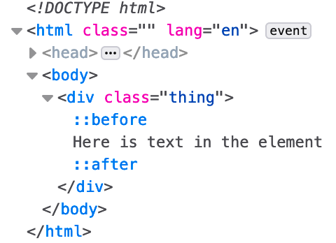
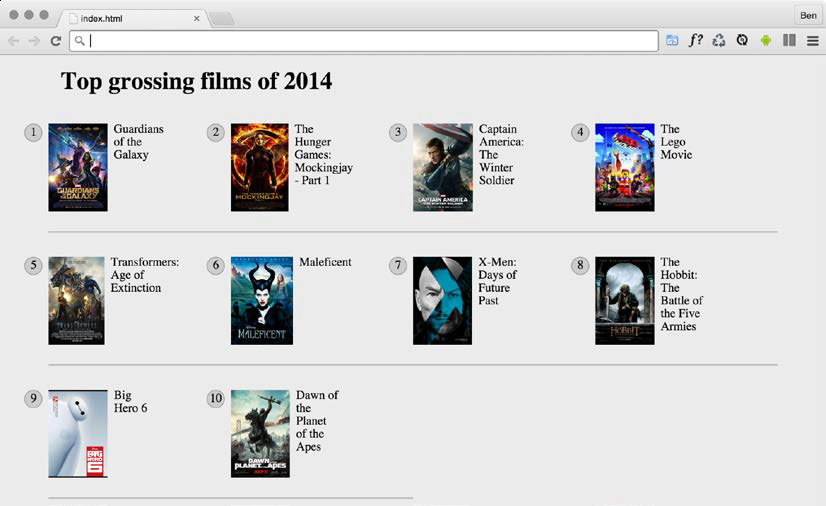
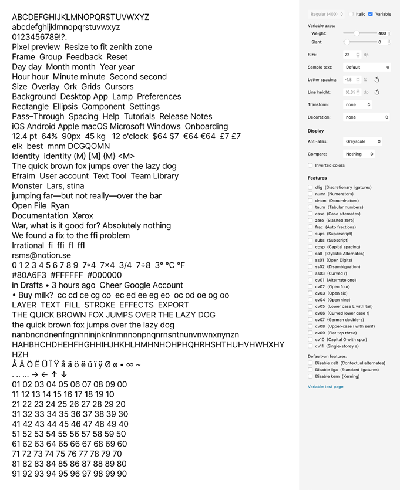
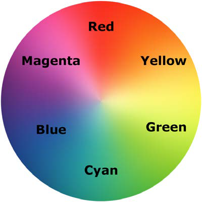

## CSS Selectors, Typography, Color Modes, and More

In the last few years, CSS has enjoyed a raft of new features.

It will be useful to look at more recent improvements to some of the fundamentals of CSS.
I don't feel that trying to know every possible CSS property and value permutation
is actually a worthy pursuit.

I think it's more sensible to develop a good
grasp of what's possible and what capabilities exist that solve the most common
problems.


We are going to concentrate in this chapter on some of the techniques,
units, and selectors I have found most useful when building responsive web designs.


As there are a quite a few topics to cover they have been grouped:
Selectors, units, and capabilities:

* ::before and ::after pseudo-elements
* Attribute selectors and substring matching
* Structural pseudo-classes, including :last-child, :nth-child, :empty,
and :not
*Combinator selectors, including child, next sibling, and subsequent sibling
* Viewport related length units: vh, vw, vmax, and vmin
* The calc() function
* CSS custom properties and environment variables
* Using @supports to fork CSS


Web typography:
* @font-face rule
* Font formats, including .woff and .woff2
* Font loading control with the font-display property
* Variable fonts and font features

Color:
* RGB
* HSL
* RGBA and HSLA
As you can see, we have a lot to get through. Let's begin.


### Selectors, units, and capabilities

* Selectors, units, and capabilities are the "meat and potatoes" of CSS.
* Master these and your power to solve problems with CSS will increase substantially.

#### Anatomy of a CSS rule

* Let's establish the terminology we use to describe a CSS rule.

````css
.round {
/* selector */
border-radius: 10px; /* declaration */
}
````
* This rule is made up of the selector (`.round`) and then the declaration
  (`border-radius: 10px`).
* The declaration is further defined by the property
  (`border-radius`) and the value (`10px`).

#### Pseudo-elements and pseudo-classes

* There is potential for some confusion when we go on shortly to talk about "pseudo"
  selectors.
* The reason being is that, in CSS, there are both pseudo-selectors and
  pseudo-elements. Let's therefore take a moment to establish the difference.
* The word "pseudo" in this context means something that is like something but not
  really it.

Here is how you create a pseudo-element in CSS:


````css
.thing::before {
    content: "Spooky";
}
````

* That inserts a `::before` pseudo-element into the `.thing` element with the content
  "Spooky."
* `::before` behaves like a first child of the element and an `::after`
  behaves like a last child.

The following image might help. It's showing a single element represented in the
Firefox developer tools, containing text with both a `::before` and an `::after`
pseudo-element added in CSS:




* The key thing to remember with pseudo-elements is that if you don't provide a
  value for content, nothing will show on the page.
* Notice the double colon before, that is how you should code pseudo-elements as it helps
  differentiate them from pseudo-selectors, which only use one.
* You can't do the same with pseudo-selectors; they always have a single colon.
* For example, `:hover`, `:active`, and `:focus` are all pseudo-selectors and are written
  with a single colon.

Let's move on and look at some of the powerful selectors available to us today in CSS.

#### CSS Level 3 selectors and how to use them

* CSS now provides incredible power for selecting elements within a page.

##### CSS attribute selectors

You've probably used CSS attribute selectors to create rules. For example, consider
the following markup:

````html
    
````

And this CSS:

````css
    img[alt] {
        border: 3px dashed #e15f5f;
    }
````
This would select the img element in the preceding code, and any others on the page
provided that they have an alt attribute.

* We could combine this with the `:not` negation selector (we will look at that in detail
  later in this chapter) to add a red border around any images that
  have no alt attribute or an alt attribute with no value:
`````css
img:not([alt]),
    img[alt=""] {
    border: 3px solid red;
}
`````

As another example, let's say we wanted to select all elements with a data-sausage
attribute:

````css
[data-sausage] {
/* styles */
}
````
* The key thing here is to use square brackets to specify the attribute you want to select.

You can also narrow things down by specifying what the attribute value is. For
example, consider the following rule:

````css
img[alt="Sausages cooking"] {
/* Styles */
}
````

This would only target images that have an alt attribute of "Sausages cooking"; for
example:

`````html

`````
We could do that in CSS2. CSS Level 3 selectors bring us substring matching attribute selectors.

##### CSS substring matching attribute selectors

CSS3 added the ability to select elements based upon the substring of their attribute
  selector.
* Begins with a certain substring
* Contains an instance of a certain substring
* Ends with a certain substring

Let's see what they look like.

###### The "beginning with" substring matching attribute selector

Consider the following markup:

````html
<li data-type="todo-chore">Empty the bins</li>
<li data-type="todo-exercise">Play football</li>
````

* Suppose that markup represents two items in a "todo" list application we are
  building.
* Even though they both have different data-type attribute values, we
  can select them both with the "beginning with" substring matching attribute selector,
  like this:

````css
[data-type^="todo"] {
/* Styles */
}
````
* The key character in all this is the ^ symbol.
* That symbol is called the "caret," although it is often referred to as the "hat" symbol too.
* In this instance, it signifies "begins with.";
* Because both data-type attributes have values that begin with "todo,"
  our selector selects them.

##### The "contains an instance of" substring matching attribute selector

The "contains an instance of" substring matching attribute selector has the following
syntax:

`````css
[attribute*="value"] {
/* Styles */
}
`````
* Like all attribute selectors, you can combine them with a type selector;

Let's try an example. Consider this markup:

````html
<p data-ingredients="scones cream jam">Will I get selected?</p>
````

We can select that element like this:

````css
[data-ingredients*="cream"] {
color: red;
}
````

* The key character in all this is the * symbol, which in this context means "contains."


##### The "ends with" substring matching attribute selector

The "ends with" substring matching attribute selector has the following syntax:

````css
[attribute$="value"] {
/* Styles */
}
````
An example should help. Consider this markup:

````html
<p data-ingredients="scones cream jam">Will I get selected?</p>
<p data-ingredients="toast jam butter">Will I get selected?</p>
<p data-ingredients="jam toast butter">Will I get selected?</p>
````

Suppose we only want to select the element with scones, cream, and jam in the
data-ingredients attribute (the first element).

We can't use the "contains an
instance of" (it will select all three) or "begins with" (it will only select the last
one) substring attribute selector.

However, we can use the "ends with" substring
attribute selector:

````css
[data-ingredients$="jam"] {
color: red;
}
````

* The key character in all this is the $ (dollar) symbol, which means "ends with."

#### Chaining attribute selectors

You can have even more possibilities for selecting items by grouping attribute
selectors.

Suppose we had this markup:

````html
<li
data-todo-type="exercise"
data-activity-name="running"
data-location="indoor"
>
Running
</li>
<li
data-todo-type="exercise"
data-activity-name="swimming"
data-location="indoor"
>
Swimming
</li>
<li
data-todo-type="exercise"
data-activity-name="cycling"
data-location="outdoor"
>
    Cycling
</li>
<li
        data-todo-type="exercise"
        data-activity-name="swimming"
        data-location="outdoor"
>
    Swimming
</li>
````
Let's suppose I only wanted to select "indoor swimming."

* I can't use just data-location="indoor" as that would get the first element too.
* I can't use data-activity-name="swimming" as that would get me the first and the third;

but I can do this:

`````css
[data-activity-name="swimming"][data-location="indoor"] {
/* Styles */
}
`````
* This selects elements that have "swimming" as the activity name, as long as they also
  have "indoor" as the location.

> Attribute selectors allow you to select IDs and classes that start
with numbers.
> 
> Before HTML5, it wasn't valid markup to start IDs
or class names with a number. HTML5 removes that restriction.
> 
> When it comes to IDs, there are still some things to remember.
There should be no spaces in the ID name, and it must be unique
on the page.
> 
> Now, although you can start ID and class values with
numbers in HTML5, CSS still restricts you from using ID and class
selectors that start with a number;
> 
> Luckily for us, we can
easily work around this by using an attribute selector; for example,`[id="10"]`.

Let's move on to how we can deal with selecting elements based upon where they are in the document.


### CSS structural pseudo-classes

CSS gives us more power to select elements based upon where they sit in the
structure of the DOM.

Let's consider a common design treatment; we're working
on the navigation bar for a larger viewport and we want to have all but the last
link over on the left.

Historically, we would have needed to solve this problem
by adding a class name to the last link so we could select it, like this:

````html
<nav class="nav-Wrapper">
<a href="/home" class="nav-Link">Home</a>
<a href="/About" class="nav-Link">About</a>
<a href="/Films" class="nav-Link">Films</a>
<a href="/Forum" class="nav-Link">Forum</a>
<a href="/Contact-Us" class="nav-Link nav-LinkLast">Contact Us</a>
</nav>
````
Sometimes, just getting a content management system to add a class to a final list item can be frustratingly difficult.
Thankfully, in those eventualities, it's no longer a concern. We can solve this
problem and many more with CSS structural pseudo-classes.

#### The :last-child selector

CSS 2.1 already had a selector applicable for the first item in a list; the `:first-child`
selector:

````css
div:first-child {
/* Styles */
}
````

CSS Level 3 added a selector that can also match the last:

````css
div:last-child {
/* Styles */
}
````

Let's look how that selector could fix our prior problem if we didn't want to, or
couldn't add, another class at the desired point in the markup:

````css
.nav-Wrapper {
display: flex;
}
.nav-Link:last-child {
margin-left: auto;
}
````

There are also useful selectors for when something is the only item: `:only-child`
and the only item of a type: `:only-of-type`.

#### The nth-child selectors

* The nth-child selectors let us solve even more difficult problems.
* With the same markup as before, let's consider how nth-child selectors allow us to select any
  arbitrary link(s) we want within the list.

Firstly, what about selecting every other list item? We could select the odd ones
like this:

````css
.nav-Link:nth-child(odd) {
/* Styles */
}
````
Firstly, what about selecting every other list item? We could select the odd ones
like this:
````css
.nav-Link:nth-child(even) {
  /* Styles */
}

````

##### Understanding what nth rules do

Here are the nth-based selectors at our disposal:
* nth-child(n)
* nth-last-child(n)
* nth-of-type(n)
* nth-last-of-type(n)

We've seen that we can use (odd) or (even) values already in an nth-based
expression, but the (n) parameter can be used in another couple of ways:
* As an integer; for example, :nth-child(2) would select the second item.
* However, you can also pass a numeric expression. For example,
  :nth-child(3n+1) would start at the first element, and then select
  every third element.

The numeric expression version of the selector is the part that can be a little baffling
at first. Let's break it down.

###### Breaking down the math
Let's consider 10 spans on a page (you can play about with these by looking at
example_06-05):

````html
<span></span>
<span></span>
<span></span>
<span></span>
<span></span>
<span></span>
<span></span>
<span></span>
<span></span>
<span></span>
````

The css style:
````css
span {
height: 2rem;
width: 2rem;
background-color: blue;
display: inline-block;
}
````

As you might imagine, this gives us 10 squares in a line:


Let's look at how we can select different ones with nth-based selections.

if I want to figure out what (2n+3) will select, I start with
the right-most number (the "3" here indicates the third item from the left) and know
it will select every second element from that point on. So, adding this rule:


````css
    span:nth-child(2n + 3) {
    background-color: #f90;
    border-radius: 50%;
}
````

Results in browser:


* As you can see, our nth selector targets the third list item and then every subsequent
  second one after that too.

The expression can also use negative numbers; for example, :nth-child(3n-2)
starts at minus 2 and then selects every third item.


````css
span:nth-child(-2n+3) {
background-color: #f90;
border-radius: 50%;
}
````


This example finds the third item again, but then goes in the opposite direction to
select every two elements (up the DOM tree and therefore from right to left in our
example)


Hopefully, the nth-based expressions are making more sense now. nth-child and
`nth-last-child` differ in that the `nth-last-child` variant works from the opposite
end of the document tree.


For example, `:nth-last-child(-n+3)` starts at 3 from
the end and then selects all the items after it. Here's what that rule gives us in the
browser:


Finally, let's consider :nth-of-type and :nth-last-of-type.

`:nth-of-type` and `:nth-last-of-type` let you be specific about the type of item
you want to select. Consider the following markup (example_06-06), which is a
mixture of div and span elements, albeit with the same class:


````html
<span class="span-class"></span>
<span class="span-class"></span>
<span class="span-class"></span>
<span class="span-class"></span>
<span class="span-class"></span>
<div class="span-class"></div>
<div class="span-class"></div>
<div class="span-class"></div>
<div class="span-class"></div>
<div class="span-class"></div>
````

If we used the selector:

````css
.span-class:nth-of-type(-2n+3) {
background-color: #f90;
border-radius: 50%;
}
````

* Even though all the elements have the same span-class class, they don't get seen
  as one group.
* The selector applies once to the span elements, and then to the div
  elements. Here is what gets selected:


* CSS doesn't count like JavaScript and jQuery! If you're used to
  using JavaScript and jQuery, you'll know that it counts from 0
  upward (zero index-based).
* For example, if selecting an element
  in JavaScript or jQuery, an integer value of 1 would actually be the
  second element. CSS, however, starts at 1 so that a value of 1 is the
  first item it matches.


#### nth-based selection in responsive web designs

I want to illustrate a real-life responsive web
design problem and how we can use nth-based selection to solve it.

Imagine we are building a page where we want to list the top grossing movies from a given year.

Our content management system simply spits all the items out in a list, but we
want to show them in a grid of sorts.


For some viewports, we will only be able to fit two items wide.

However, as the
viewport increases in width, we can show three items and at larger sizes still, we
can show four.

Here is the problem, though. Regardless of the viewport size, we
want to prevent any items on the bottom row from having a border on the bottom.

You can view this code at example_06-09. Here is how it looks with four items wide:



See that pesky border below the bottom two items? That's what we need to remove.

Now, because there are a different number of items on each row at different
viewports, we will also need to change the nth-based selection at different viewport
widths.

But we can use media queries for that. For the sake of brevity, I'm not going
to show you the selection for each media query. I'll just show you the selection that
matches four items per row, as you can see in the preceding screenshot.


````css
@media (min-width: 55rem) {
.Item {
width: 25%;
}
/* Get me every fourth item and of those, only ones that are in
the last four items */
.Item:nth-child(4n+1):nth-last-child(-n+4),
/* Now get me every one after that same collection too. */

.Item:nth-child(4n+1):nth-last-child(-n+4) ~ .Item {
border-bottom: 0;
}
}
````

You'll notice here that we are chaining the nth-based pseudo-class selectors,
much like we chained attribute selectors earlier in this chapter.

It's important to understand when you chain nth selectors like this that the first selector doesn't
"filter" the selection for the next selector; rather, the element has to match each of
the selections.

````css
.Item:nth-child(4n+1):nth-last-child(-n+4),
````

`.Item` has to be the first item of four and also be one of the last four:


Thanks to nth-based selections, we have a defensive set of rules to remove the
bottom border, regardless of the viewport size or number of items we are showing.


One nifty bit of selection we are doing in that prior example is using the
"subsequent sibling" selector. We haven't looked at that, so we will cover that next.


#### Combinator selectors – child, next sibling, and subsequent sibling

Let's understand the basic selector pattern where one class followed by another selects any descendant that matches.

For example, `.parent .descendant {}` would select any element that was a
descendant of the `.parent` element with a class of `.descendant`, no matter how
many levels deep.

###### The child combinator

The child combinator only selects direct descendants. Consider this markup:

`````html
<div class="parent">
  <div class="descendant child">
    <div class="descendant grandchild"></div>
  </div>
</div>
`````

We can select only the direct "child" of the parent element, like this:

````css
.parent > .descendant {
/* Styles */
}
````

Notice the right angle bracket between the two class names in the selector; that's the
child combinator symbol.

###### The next sibling

Consider another example:

````html
<div class="item one">one</div>
<div class="item">two</div>
<div class="item">three</div>
<div class="item">four</div>
<div class="item">five</div>
<div class="item">six</div>
````

Let's suppose we wanted to select an item, but only if it is the next sibling of `.one`.
With that markup, we could select the two elements like this:

````css
.one + .item {
border: 3px dashed #f90;
}
````

The + symbol there means "next sibling," so select the next sibling element of `.one`.

###### The subsequent sibling

With the same markup from the previous example, if we wanted to select all items
after the third, we could do this:

````css
.item:nth-child(3) ~ .item {
border: 3px dashed #f90;
}
````

The ~ symbol, called "tilde," says "every subsequent sibling."

###### The negation `(:not)` selector

* Another handy selector is the negation pseudo-class selector.
* This is used to select everything that isn't something else. Consider this:

````html
<div class="a-div"></div>
<div class="a-div"></div>
<div class="a-div"></div>
<div class="a-div not-me"></div>
<div class="a-div"></div>
````

And then these styles:

````css
div {
  display: inline-block;
  height: 2rem;
  width: 2rem;
  background-color: blue;
}
.a-div:not(.not-me) {
  background-color: orange;
  border-radius: 50%;
}
````

* Our final rule will make every element with a class of` .a-div` orange and round,
  with the exception of the div that also has the `.not-me` class.


You can find that code
in the example_06-07 folder of the code samples (remember, you can grab them all
at https://rwd.education):


* we have looked primarily at what's known as structural
  pseudo-classes (full information on this is available at http://
  www.w3.org/TR/selectors/#structural-pseudos).
* CSS has many more selectors. If you're working
  on a web application, it's worth looking at the full list of UI
  element states pseudo-classes (http://www.w3.org/TR/
  selectors/#UIstates)

###### The empty `(:empty)` selector
* I've encountered situations where I have an element that includes some padding on
  the inside and gets content dynamically inserted.
* Sometimes, it gets content inserted, while sometimes, it doesn't.
* The trouble is, when it doesn't include content, I still see
  the padding.
Consider the HTML:
````html
    <div class="thing"></div>
````

And here's the CSS:

````css
.thing {
  padding: 1rem;
  background-color: violet;
}
````

Without any content in that element, I still see the background color. Thankfully, we
can easily hide it, like this:

````css
.thing:empty {
display: none;
}
````

Whitespace is not "no" space! And nor would something like a line break be either.

````html
<div class="thing"> </div>
````

be aware that a comment doesn't affect whether an
element is considered "empty" or not. For example, this is still considered empty:

````html
<div class="thing"><!--I'm empty, honest I am--></div>
````

We've looked at how we can select items in our responsive
world. But how about how we size them? We'll look at viewport-percentage lengths
next.

##### Responsive viewport-percentage lengths (vmax, vmin, vh, and vw)
* CSS Values and Units Module Level 3 (http://www.w3.org/TR/css3-
  values/#viewport-relative-lengths) ushered in viewport relative units.
* These  are great for responsive web design, as each unit is a percentage length of the
  viewport:
  * The vw unit, where each vw unit is 1% of the viewport width.
  * The vh unit, where each vh unit is 1% of the viewport height.
  * The vmin unit (for viewport minimum; equal to the smaller of either vw or vh).
  * The vmax (viewport maximum; equal to the larger of either vw or vh).


Want a modal window that's 90% of the browser height? This is as easy as:

````css
.modal {
    height: 90vh;
}
````

You can perhaps find more utility for these units when coupled with fonts.

For example, it's now trivially easy to create text that scales in size, depending upon
the viewport. For example:

````css
.Hero-text {
font-size: 25vw;
}
````
* Now, the text will always be sized as a percentage of the viewport width.


* We've dealt with selectors of various types, and some of the more recent
length units that are particularly relevant to responsive designs.
* Before we move on to web typography, let's cover some important capabilities of CSS.

##### CSS calc

How many times have you been trying to code out a layout and thought something
like, "it needs to be half the width of the parent element minus exactly 10px"?

This is particularly useful with responsive web design, as we never know the size of the
screen that will be viewing our web pages.

Thankfully, CSS has a way to do this. It's
called the `calc()` function. Here's that example in CSS:

`````css
.thing {
width: calc(50% - 10px);
}
`````

* Just be careful to include whitespace around your symbols.
* If I had written `calc(50% -10px)`, for example, missing the whitespace around the minus sign,
  the declaration would not have worked.
* Addition, subtraction, division, and multiplication are supported, so it's possible to
  solve a bunch of problems that have been impossible without JavaScript in the past.
* You can also use CSS custom properties in there too. If you don't know anything
  about CSS custom properties.

##### CSS custom properties

* CSS custom properties are often referred to as "CSS variables," although that is not
  necessarily their only use case.

> You can find the full specification here: http://dev.w3.org/csswg/css-variables/.


CSS custom properties allow us to store information in our stylesheets that can then
be utilized in that stylesheet or read/written to with JavaScript

Let's start with a simple use case; storing a font-family name that we can then
reference more simply later in the stylesheet:

````css
:root {
    --MainFont: 'Helvetica Neue', Helvetica, Arial, sans-serif;
}
````

we are using the `:root` pseudo-class to store the custom property in the
document root (although you can store them inside any rule you like).


A custom property always begins with two dashes, then the custom name, and
then, at the end of the property, just like a normal CSS property, we terminate the
property with a colon.

We can reference that value elsewhere in our stylesheet with the var() notation,
like so:

````css
.Title {
    font-family: var(--MainFont);
}
````

* You could obviously store as many custom properties as you need in this manner.
* The main benefit of this approach is that you can change the value inside the variable
  and every rule that makes use of the variable gets the new value without having to
  amend them directly.


Let me show you a very simple example of using CSS custom properties with
JavaScript. (example_06-11)

* We will make a page with the
  poem "If," by Rudyard Kipling. At the bottom is a simple light/dark mode toggle
  button.
* All the button will do is toggle the value of two CSS custom properties:
  --background and --foreground.

Here is our CSS:

`````css
body {
  background-color: var(--background);
  color: var(--foreground);
}
`````
Essentially, it just says that if the foreground variable is `#eee` (nearly white), then make it `#333` (a dark
grey); otherwise, make it `#eee`. And, if the background variable is `#333`, make it
`#eee`; otherwise, make it` #333`:

````javascript
var root = document.documentElement;
var btn = document.getElementById("colorToggle");

btn.addEventListener("click", e => {
    root.style.setProperty("--background", getComputedStyle(root).
                            getPropertyValue('--background') === "#333" ? "#eee" : "#333");
    root.style.setProperty("--foreground", getComputedStyle(root).
                            getPropertyValue('--foreground') === "#eee" ? "#333" : "#eee");
})
````

Custom properties also behave like other properties in terms of specificity.

For example, we set our custom properties at the root level, but if they are redeclared
closer to the element in question, the more specific value will override the first.

Consider this CSS:

````css
:root {
--backgroundColor: red;
}
header {
--backgroundColor: goldenrod;
}
````

The header and any elements within it that make use of the --backgroundColor
custom property, which will have a "goldenrod" background color, whereas other
elements will have a red background.

###### Setting a fallback value

* There may be a situation where you want to protect against a custom property
  being unavailable.
* You can do that by providing a fallback value.
* The syntax is
  straightforward: simply provide your fallback value after the custom property
  name and a comma.

`````css
.my-Item {
    background-color: var(--backgroundColor, #555);
}
`````

I wanted to use the --backgroundColor
custom property, but default to a dark gray color if that variable was unavailable.


###### `env()` environment variables

In addition to custom properties we might make for ourselves, there are occasionally
properties that can be read in from the environment we are operating in.

The only solid example of these I'm currently aware
of are the safe-area-inset properties applicable to notched mobile phones.

Made famous by the iPhone X, the "safe-areas" relate to the sections at the top and bottom
of the screen where areas of UI or physical buttons impinge upon the viewing area.

Environment variables are defined with the env() function.

Values are passed into this function just like you would any other CSS function.

For example, if we wanted to add padding to the top of our element equal to the height of the environments
"safe area inset top," we could do this:

````css
padding-top: env(safe-area-inset-top);
````

If the browser has that value available and it understands the env() function, it will
apply the value; otherwise, it will skip over it to the next declaration.

You can read the current specification for environment variables here: https://
drafts.csswg.org/css-env-1/#env-function.

* The fact that they can update "on the fly" means they are useful in all manner of scenarios. 
* The fact that they can be easily read and written to from script elevates them far beyond
  what was possible with the kind of variables made popular by CSS preprocessors
  like Sass, Less, and so on.


* Custom properties, along with many of the features we have looked at and shall
  look at, cannot be guaranteed to work in every browser you might need to support.

CSS has an elegant syntax for encapsulating code that pertains to the
latest features.

##### Using @supports to fork CSS

When you're building out a responsive web design, attempting to provide a
single design that works everywhere, on every device, it's a simple fact that you'll
frequently encounter situations when features or techniques are not supported on
certain devices.

In these instances, you'll likely want to create a fork in your CSS.
If the browser supports a feature, provide one chunk of code; if it doesn't, it gets
different code.

This is the kind of situation that gets handled by if/else or switch statements in
JavaScript. In CSS, we use the @supports at-rule.


###### Feature queries

* The native solution to forking code in CSS is to use "feature queries," part of the CSS
  Conditional Rules Module Level 3 (http://www.w3.org/TR/css3-conditional/).
* Support was introduced in iOS and Safari 9, Firefox 22, Edge 12, and Chrome 28.

Feature queries follow a similar syntax to media queries. Consider this:

````css
@supports (flashing-sausages: lincolnshire) {
  body {
    sausage-sound: sizzling;
    sausage-color: slighty-burnt;
    background-color: brown;
  }
}
````
Here, the styles will only get applied if the browser supports the flashing-sausages
property in combination with the lincolnshire value.


How about we use Grid when browsers
support it and fall back to another layout technique when they don't? Consider
this example:

````css
@supports (display: grid) {
  .Item {
  display: inline-grid;
  }
}
@supports not (display: grid) {
  .Item {
  display: inline-flex;
  }
}
````

* This pattern is fine if the browser supports
  @supports (yes, I realize that is confusing), but if it doesn't, it won't apply any of
  those styles.
* If you want to cover off devices that don't support @supports, you're better off
  writing your default declarations first and then your @supports-specific one after.
* That way, the prior rule will be overruled if support for @supports exists, and
  the @supports block will be ignored if the browser doesn't support it.

Our prior example could, therefore, be reworked to:

````css
.Item {
display: inline-flex;
}
@supports (display: grid) {
.Item {
display: inline-grid;
}
}
````

###### Combining conditionals

You can also combine conditionals.

* Let's suppose we only wanted to apply some rules if both Flexbox and pointer: coarse were supported. Here is what that might look like:
`````css
@supports ((display: flex) and (pointer: coarse)) {
.Item {
display: inline-flex;
}
}
`````
* Here, we have used the `and` keyword but we could use `or` as well as, or instead of
  it.

For example, if we were happy to apply styles if those two prior property/value
combinations were supported, or 3D transforms were supported:

````css
@supports ((display: flex) and (pointer: coarse)) or
  (transform: translate3d(0, 0, 0)) {
  .Item {
  display: inline-flex;
  }
}
````
* Note the extra set of parentheses that separates the `display` and `pointer` conditional
  from the `transform` conditional.
* As with media queries, put your
  "default" styles first, and then your enhancement inside a feature query @supports
  at-rule. 
* Remember, you can combine queries and also offer differing possibilities in
  which the enclosed code can apply.

### Web typography

* Typography on the web has come on tremendously in the last few years.
* Where once it was necessary to include a slew of different file formats, things have pretty
  much settled on `.woff` and the newer `.woff2`.
* In addition, we have more control over the particulars of our fonts in CSS and new variable fonts are popping up on a
  monthly basis.

First, however, let's talk about system fonts as they represent the best performing
web typography choice you can opt for.


#### System fonts

* Each operating system has its own set of fonts that come preinstalled.
* There aren't many fonts you can rely upon to be installed on every device a user might view your site with.

Subsequently, we've grown accustomed to writing font "stacks," which enable us to
write a font "wish list" for the browser. For example:

````css
font-family: -apple-system, BlinkMacSystemFont, Roboto, Ubuntu,
'Segoe UI', 'Helvetica Neue', Arial, sans-serif;
````

* The browser reads this declaration and goes left to right until it finds a font it has
  available and then chooses that to render the associated text.

In our example system font stack here, 
* macOS users will get San Francisco or Helvetica (-apple-system tells Safari to pick San Francisco and
BlinkMacSystemFont tells Chrome to use Helvetica), 
* Android will get "Roboto,"
* the popular Ubuntu Linux distribution will get "Ubuntu," 
* Windows users will see "Segoe UI," and then we have some last ditch attempts to get something nice with
"Helvetica Neue" or "Arial." 
* If all else fails, we tell the browser to use any sans-serif font it has.


For a lot of situations, using system fonts is a compelling choice.

The tradeoff is that with system fonts, you can never be entirely sure how your text is
being rendered on the user's device.

If specific typography is crucial to the project at
hand, you'll want to look at web fonts with @font-face.

#### The @font-face CSS rule

* The @font-face CSS rule has been around since CSS2 (but was subsequently absent
  in CSS 2.1).
* It was even supported partially by Internet Explorer 4 (no, really)!
* So, what's it doing here, when we're supposed to be talking about the latest CSS?

Well, as it turns out, @font-face was reintroduced for the CSS Fonts Module
(http://www.w3.org/TR/css3-fonts).

Due to the historic legal quagmire of using
fonts on the web, it took years to gain traction as the de facto solution for web
typography.

Like anything on the web that involves assets, in the beginning, there was no single file
format for font delivery.

The Embedded OpenType (files with an .eot extension) font
was Internet Explorer's, and not anyone else's, preferred choice.

Others favored the
more common TrueType (the.ttf file extension), while there was also Scalable Vector
Graphics (.svg) and then the Web Open Font Format (the.woff / .woff2 extension).

Thankfully, as of 2020, you really only need to consider WOFF (Web Open Font
Format), although there are two types: WOFF and WOFF2.

Where a user can use WOFF2, that will always be preferable as it is simply a more efficient way of
compressing the font information.

However, the good news is that adding each custom font format for every browser
is easy.

#### Implementing web fonts with @font-face

* There are a number of online font services for getting beautiful typefaces onto the
  web. 
* Google Fonts and Adobe Fonts are probably the two most popular.
* They each have their own variation of the required syntax for getting their fonts onto your
  websites.

To make a web font available for use in our CSS, we use the @font-face at-rule.
This lets us provide a name for the font that we can then reference and also tells
the browser where to go and fetch this file from. Let's look at the syntax:


````css
@font-face {
    font-family: 'InterRegular';
    src: url('Inter-Regular.woff2') format('woff2'),
    url('Inter-Regular.woff') format('woff');
font-weight: normal;
font-style: normal;
font-display: fallback;
}
````

Inside the @font-face braces, we give our font the "InterRegular" name. I could
have called it "FlyingBanana" had I wanted; it wouldn't affect anything other than I
would then need to reference this font with that name when I wanted to use it.


````css
.hero-Image {
font-family: 'FlyingBanana', sans-serif;
}
````

* You can then see two successive url() and format() sections within our src
  property.
* Each pair of these separated with a comma.
* As long as the browser can understand .woff2 and download the file, it will do so. If, however, the browser can't find that file, or can't understand
  .woff2, it will download the .woff file listed afterward.
* It's important to pay attention to the paths the fonts are stored in.
* If we were to place fonts in a folder inventively called fonts on the same level as a css folder, we would
  need to amend our paths. So, our @font-face block would become:
````css
@font-face {
font-family: 'InterRegular';
src: url('../fonts/Inter-Regular.woff2') format('woff2'),
url('../fonts/Inter-Regular.woff') format('woff');
font-weight: normal;
font-style: normal;
font-display: fallback;
}
````

#### Optimizing font loading with font-display

* If your main font is a web font, it's a good idea to request the file up front by loading
  it with a link in the `head` section of your HTML with the rel attribute value as
  `preload`.

````html
<link
rel="preload"
href="fonts/inter.var.woff2"
as="font"
type="font/woff2"
crossorigin
/>
````

>> You can read more about this font optimization technique here: 
> https://developers.google.com/web/fundamentals/performance/resource-prioritization


* Adding a link with rel="preload" added in this way triggers a request for the web
  font early in the critical rendering path, without having to wait for the CSSOM to
  be created.
* Browsers that support .woff2 also support the preload value in the
  rel attribute.

* We can make further optimizations with web fonts by making use of the
  `font-display` property.


##### font-display

* For browsers that support it, we can also make use of the relatively new
  `font-display` property of CSS (older browsers ignore it):
````css
font-display: fallback;
````

* It provides some control over how fonts should get displayed.
* The fallback value we have provided sets an extremely short "block" period and
  a short "swap" period.


What the browser does in terms of displaying fonts:
* Imagine a browser loading our web page in which we have specified a web font
  for our text. 
* The browser already has the HTML and is parsing the CSS, and learns
  it needs to download a font in order to display the text it has as intended. 
* Before it draws any text to screen, it hangs on, waiting for the web font so it can paint the text
  onto the page as needed. 
* This delay is referred to as a "FOIT," standing for "Flash of
  Invisible Text."
* As soon as the font arrives, the browser parses it and paints the text to the screen
  accordingly.
* The hope is that this delay is imperceptible.

There are two schools of thought on how best to handle things.

* One option is to wait for the font to be downloaded, usually for up to a few seconds
  but sometimes indefinitely; Safari is the most famous proponent of this option.
* The second option is to render the text with a system font initially and then replace
  the font with the correct font when the browser has it.

This redraw of text from system font to actual intended font is known as a "Flash of
Unstyled Text," or "FOUT" for short.

All the font-display setting does is allow us some control over what we would
like to see happen.

The possible values are:
* auto: Whatever the browser determines is most appropriate.
* block: Get a white screen for up to 3 seconds (but the delay is ultimately at the browser's discretion) and then the actual font can replace any system
displayed one at any future point.
* swap: There is a very short blocking period (100 ms is the recommended amount) to let the web font load; otherwise, a system font shows and the
web font can be swapped in whenever it is available.
* fallback: This option prevents a web font from replacing a system font if a set amount of time has passed (3 seconds is the recommendation). This
option blocks for around 100 ms initially and allows a swap for up to 3 s, but after that, if the web font subsequently arrives, it doesn't get applied.
* optional: Here, the browser allows a very short duration for the web font to load (100 ms) but no swap period. The result of this is that the browser
has the option of cancelling the font download if it hasn't arrived, or if it has, using it for subsequent page loads.

The most recent development in web fonts, and probably the one that has most developers excited, is "variable" fonts.


##### Variable fonts

* There is a W3C specification and they are supported in the latest browsers.
* However, as support is
  limited to the latest browser versions and operating systems, while we will cover
  variable fonts here, be aware that the reality for the next few years is that you will
  need to consider fallback scenarios.
* A "normal" font contains the information and glyphs for one variation of a typeface;
* a variable font, in a single
  file would contain everything needed for every variation of a "normal"font. Bold, Italic, Thin,
  Black, Medium, and more besides!
* A variable version of a font is usually considerably larger in file size terms than a "normal" version. 
* However, it can still make sense when you are making heavy use of a single typeface.

Let's look at what we can do with a variable font.


###### font-face changes

First, let's consider how we tell the browser we are working with a variable
font in the first place.

It's the @font-face syntax again but with a few changes:

`````css
@font-face {
font-family: 'Inter-V';
src: url('fonts/inter.var.woff2') format('woff2-variations');
font-weight: 100 900;
font-style: oblique 0deg 10deg;
font-display: fallback;
}
`````

* The first thing to note is the format. We are setting this to woff2-variations to tell
  the browser this is a font file that makes use of variations.
* The next thing to keep in mind is that we are using a range for font-weight. The
  two-word value syntax we are using here is only understood by browsers that
  understand variable fonts.
* Another thing to remember is that we have font-style, which is also being
  provided with a multiple value syntax.
* The oblique keyword tells the browser
  the next values relate to how oblique the font can be, and the two values after that
  define the range.
* Finally, note that we have used the font-display property here to tell the browser
  how we want to handle the loading and display of this font, but that is no different
  than non-variable fonts.


###### Using a variable font

* Variable fonts use what's termed a "variation axis."
* A variation axis is just a way of defining two points at either end of a scale. You
  can then choose any point along the scale to display your font. The scale doesn't
  need to be vast; in fact, it can be as simple as "on" or "off" (not much of a scale,
  I know).
* Variation axes are subdivided into two groups: registered and custom.

####### Registered axis

Registered axes are the most popular ones, which the specification has deemed
worthy of their own CSS property:

* Weight: How heavy the text appears; for example, font-weight: 200.
* Width: How narrow (condensed) or wide the text appears; for example,
  font-stretch: 110%.
* Italic: Whether the font is being displayed as italic or not; for example,
  font-style: italic.
* Slant: Don't confuse this with italic. This simply alters the angle of the text; it
  doesn't substitute any glyphs; for example, font-style: oblique 4deg.
* Optical-size: This is the only one of the registered axes that has required
  a new font property. Using font-optical-sizing lets you alter, yes, you
  guessed it, the optical sizing. But what is that? It's the practice of altering
  a glyph based upon the size it is displayed at to aid clarity. This means the
  same glyph displayed at a large size might enjoy thinner stems, for example.


There is also a low-level property that lets you bundle up your variable font settings
into a single property/value combination:

````css
font-variation-settings: 'wght' 300, 'slnt' -4;
````

Here, we have set font-weight to 300 and the angle of the slant to -4.


####### Custom axis

Variable fonts can include their own axis. For example, the "FS Pimlico Glow VF"
font has a "glow" axis. You can amend that like this:

`````css
font-variation-settings: 'GLOW' 500;
`````

Notice how this custom axis is written in uppercase; that is, 'GLOW'? That's how
to determine the difference between a registered and custom axis in variable font
settings.

####### Font features

Variable fonts can also include their own "features." These features can be literally
anything the font designer decides to dream up! Take a look at the choices for Inter:



All of those "features" are settings that can be turned on with CSS. You can
play about with these settings for yourself here: https://rsms.me/inter/
lab/?varfont=1.

 * When we want to apply these custom features, we make use of the font-featuresettings
   property.


````css
font-feature-settings: 'zero';
````

This "slashed zeroes" option is a binary choice, so it is not necessary to write 'zero' 1.

if we wanted to toggle this setting off further into our styles, we could
write:

````css
font-feature-settings: 'zero' 0;
````

When you want to apply multiple font-feature settings, you can comma-separate
them. So, if we wanted to have "Lowercase L with tail" and "Uppercase i with serif,"
we could write this:

````css
font-feature-settings: 'cv08', 'cv05';
````

There is plenty more in the way of settings and features specified in CSS Fonts
Module Level 4. We have just scratched the surface! To keep up with developments,
read the specification as it happens here: https://drafts.csswg.org/css-fonts-4/#introduction.


Have a look at the CSS from our example page:

````css
:root {
    --MainFont: 'Helvetica Neue', Helvetica, Arial, sans-serif;
}
@font-face {
  font-family: 'Inter-V';
  src: url('fonts/inter.var.woff2') format('woff2-variations');
  font-weight: 100 900;
  font-display: fallback;
  font-style: oblique 0deg 10deg;
}

body {
  background-color: var(--background);
  color: var(--foreground);
  transition: all 0.35s;
  font-size: 1.2em;
  font-family: 'sans-serif';
  font-family: var(--MainFont);
  font-weight: 400;
}
@supports (font-variation-settings: 'wdth' 200) {
  body {
    font-family: 'Inter-V';
    font-variation-settings: 'wght' 300, 'slnt' -4;
    font-feature-settings: 'cv08', 'cv05';
  }
}
````

* We have a CSS custom property defined for our system font-stack, 
* a font-face loading a variable font, complete with ranges defined for weight and slant. 
* We have sans-serif as the default font-stack,  which we then overwrite with the font-stack defined in the custom property for
  browsers that understand it.
* Finally, we feature test for variable fonts and define
  settings for it, also adding in some additional font features we'd like to see.


This brings us to the end of our discussion on web typography. So far in this
chapter, we have looked at how CSS has given us new powers of selection and
the ability to add custom typography to our designs. Now, we'll look at ways CSS
allows us to work with color.


#### CSS color formats and alpha transparency

* When we start using CSS, we typically start by defining color as a hex value.
* CSS provides more powerful ways to declare color.
* We are going to explore another two: RGB and HSL.
* These two formats enable us to use an alpha channel alongside them (RGBA and HSLA, respectively).

###### RGB color

* RGB (red, green, and blue) is a coloring system that's been around for decades.
* It works by defining different values for the red, green, and blue components of
  a color.
* For example, a red color might be defined in CSS as a hex (hexadecimal)
  value, #fe0208:

````css
.redness {
color: #fe0208;
}
````

* I can recommend this blog post at Smashing Magazine: http://www.smashingmagazine.com/2012/10/04/the-code-side-of-color/.

However, with CSS, that color can equally be described with an RGB notation:

````css
.redness {
color: rgb(254, 2, 8);
}
````

* Most image editing applications show colors as both hex and RGB values in their
  color picker.
* In the CSS, after defining the color mode (for example, RGB), the values for red, green, and
  blue are comma-separated in that order within parentheses (as we have done in
  the previous code).

###### HSL color

* Besides RGB, CSS also allows us to declare color values as hue, saturation, and
  lightness (HSL).
* What makes HSL such a joy to use is that it's relatively simple to understand the
  color that will be represented based on the values given.

HSL works on a 360° color wheel. It looks like this:



* The first figure in an HSL color definition represents hue. 
* Looking at our wheel, we  can see that yellow is at 60°, green is at 120°, cyan is at 180°, blue is at 240°, magenta
  is at 300°, 
* finally red is at 360°. So, as the aforementioned HSL color had a hue  of 315, 
* it's easy to know that it will be between magenta (at 300°) and red (at 360°).
* The following two values in an HSL definition are for saturation and lightness,
  specified as percentages.
* For a more saturated or
  "colorful" appearance, use a higher percentage in the second value.
* The final value,
  controlling the lightness, can vary between 0 percent for black and 100 percent for
  white.

For example, our red color can be defined in HSL values as follows:

````css
.redness {
color: hsl(359, 99%, 50%);
}
````

If we wanted to make a slightly darker color, we could use the same HSL value and
merely alter the lightness (the final value) percentage value only:


````css
.darker-red {
color: hsl(359, 99%, 40%);
}
````

###### Alpha channels

* So far, you'd be forgiven for wondering why on earth we'd bother using HSL or
  RGB instead of our trusty hex values we've been using for years.
* Where HSL and RGB differ from hex is that they allow the use of an alpha transparency channel so
  that something beneath an element can "show through."
* An HSLA color declaration is similar in syntax to a standard HSL rule.

You must declare the value as hsla (rather than merely hsl) and add an additional opacity value,
given as a decimal value between 0 (completely transparent) and 1 (completely
opaque). For example:

````css
.redness-alpha {
color: hsla(359, 99%, 50%, 0.5);
}
````


The RGBA syntax follows the same convention as the HSLA equivalent:


`````css
.redness-alpha-rgba {
color: rgba(255, 255, 255, 0.8);
}
`````

Why not just use opacity? 

* As CSS allows elements to have opacity set with the opacity declaration.
* When we apply opacity to an element, a value is set between zero and one in
  decimal increments (for example, opacity set to .1 is 10 percent).
* Opacity differs from RGBA and HSLA in that setting an opacity value on an element effects
  the entire element, whereas setting a value with HSLA or RGBA allows particular
  parts of an element to have an alpha layer.
* An element could have an HSLA value for the background but a solid color for the text within it.

### Summary

In this chapter, we've learned how to select almost anything we need on the page
with CSS's powerful selection capabilities. We now understand CSS's more powerful
color capabilities and how we can apply colors with RGB and HSL, complete with
transparent alpha layers for great aesthetic effects.

In this chapter, we've also learned how to add custom web typography to a design
with the @font-face rule, freeing us from the shackles of the humdrum selection
of web-safe fonts. We also took a dive into variable fonts and considered the
possibilities they have to offer.

In among all that, we also found time to look at CSS custom properties and the
@supports at-rule for providing feature forks in our code.

Despite all these great new features and techniques, we've only picked at the surface
of what we can do with CSS.

See you in a moment for Chapter 7, Stunning Aesthetics with CSS. There, we will look
at even more CSS with text shadows, box shadows, gradients, multiple backgrounds,
and so much more!